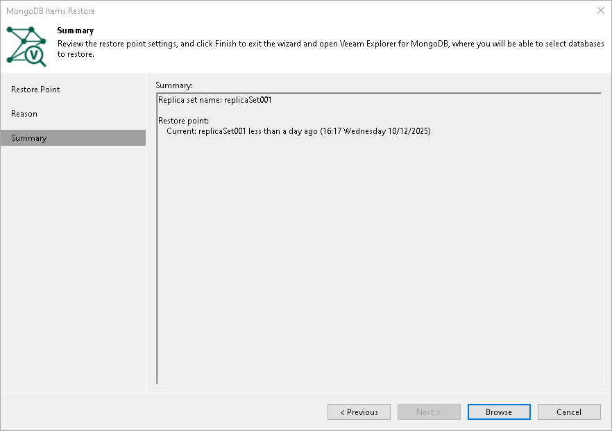

# Step 4. Complete Restore Process

At the Summary step of the wizard, review the settings and launch Veeam Explorer for MongoDB.

1. Review settings of the restore process.
2. Click Browse to start the recovery process. For more information, see [Veeam Explorer for MongoDB](vemdb_user_guide.md).

