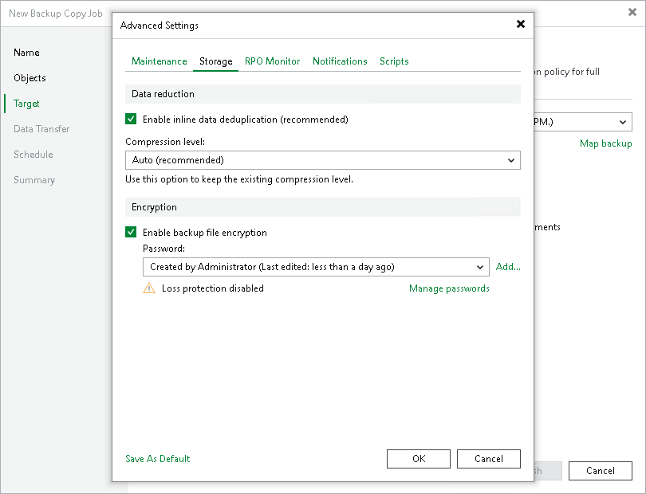

# Storage Settings

To specify compression, deduplication and encryption settings for backup files stored in the target backup repository, do the following:

1. At the Target step of the wizard, click Advanced job settings.
2. Click the Storage tab.
3. In the Data reduction section, specify data compression and deduplication settings:

* By default, Veeam Backup & Replication performs deduplication before storing copied data in the target backup repository. To disable data deduplication, clear the Enable inline data deduplication check box.

For details on deduplication, see [Deduplication](compression_deduplication.md#deduplication).

* From the Compression level list, select a compression level.

For details on data compression levels, see [Data Compression](compression_deduplication.md#data-compression).

1. In the Encryption section, specify encryption settings:

* To encrypt the backup file created by the backup copy job, select the Enable backup file encryption check box.
* From the Password field, select a password that you want to use to encrypt the backup file. If you have not created a password beforehand, click Add or use the Manage passwords link to specify a new password. For more information, see [Password Manager](password_manager.md).

If the backup server is not connected to Veeam Backup Enterprise Manager, you will not be able to restore data from encrypted backups in case you lose the password. Veeam Backup & Replication will display a warning about it. For more information, see [Decrypting Data Without Password](decrypt_without_pass.md).

You can select a Key Management System (KMS) server in the Password field. To do this, the KMS server must be added to Veeam Backup & Replication in advance. If you choose to use KMS keys for backup file encryption at this step of the wizard, Veeam Backup & Replication immediately starts communication with the KMS server to retrieve the encryption keys. To learn more, see [Key Management System Keys](kms.md).

|  |
| --- |
| Note |
| When specifying encryption settings, consider the following:   * If you enable encryption for an existing backup copy job, Veeam Backup & Replication applies new settings only starting from the next active full backup (created manually or by the GFS schedule). The active full backup file and subsequent incremental backup files in the backup chain will be encrypted with the specified password.   Note that if you disable the Read the entire restore point from source backup instead of synthesizing it from increments option in the backup copy job, you will have synthetic full backups, not active full backups. For details, see [Define Backup Copy Target](mongo_backup_copy_target.md).   * Encryption is not retroactive. If you enable encryption for an existing job, Veeam Backup & Replication does not encrypt the previous backup chain created with this job. If you want to start a new chain so that the unencrypted previous chain can be separated from the encrypted new chain, follow the scenario described in [this Veeam KB article](https://www.veeam.com/kb1885). |

