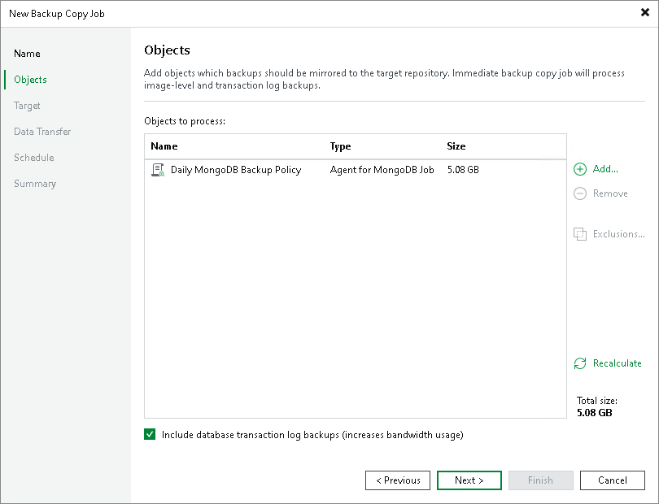

# Step 3. Select Backups to Process

At the Objects step of the wizard, select workloads whose restore points you want to copy to the target backup repository:

1. Click Add.
2. Select a type of a source from which you want to copy restore points:

* From jobs. You will see existing backup jobs. Veeam Backup & Replication will copy restore points created by the selected backup jobs.

[For the periodic copy mode] Note that if multiple jobs process one workload, Veeam Backup & Replication copies only restore points created by the first job in the Objects to process list.

* From repositories. You will see all backup repositories in the backup infrastructure. Veeam Backup & Replication will copy restore points stored on the selected backup repositories.

If you select repositories as sources, and target new jobs to the repositories in future, Veeam Backup & Replication will update backup copy job settings automatically to include these jobs to be copied.

1. In the Add Objects window, select the necessary sources or workloads.
2. Click Add.
3. [For the immediate copy mode] If you have configured processing of transaction log backups in the source backup jobs, and want to copy these log backups to the target repository, select the Include database transaction log backups check box.

|  |
| --- |
| Note |
| If you delete the source backup job after creating the backup copy job, backup files will become orphaned. The orphaned backup files are displayed under the Backups > Disk (Orphaned) node. In certain cases, the backups can be displayed in other nodes:   * In case of capacity tier, the backups are displayed under the Backups > Capacity Tier (Orphaned) node in the inventory pane. * In case of object storage, the backups are displayed under the Backups > Object Storage (Orphaned) node in the inventory pane. |

