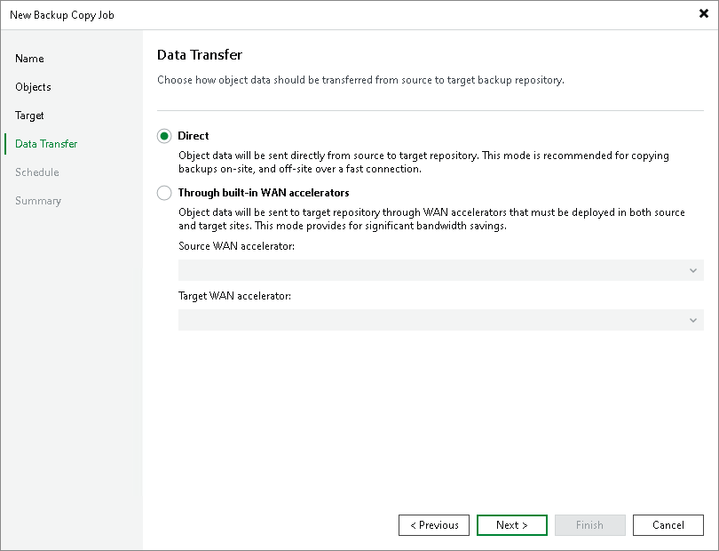

# Step 7. Specify Data Path Settings

In this article

At this step of the wizard, you can select how Veeam Backup & Replication will transport backed up data — directly or through WAN accelerators. By default, during the backup copy job Veeam Backup & Replication transports data directly from the source backup repository to target backup repository. This type of transport is recommended if you plan to copy backup files over high-speed connections.

If you plan to copy backup files over WAN or slow connections, it is recommended that you configure source and target WAN accelerators in the backup infrastructure and copy backups through these WAN accelerators. For details, see [WAN Acceleration](wan_acceleration.md).

To use WAN acceleration for the backup copy job:

1. At the Data Transfer step of the wizard, select the Through built-in WAN accelerators option.
2. From the Source WAN accelerator list, select a WAN accelerator configured in the source site.
3. From the Target WAN accelerator list, select a WAN accelerator configured in the target site.

Requirements and Limitations for WAN Accelerators

* You must not assign one source WAN accelerator to several backup copy jobs that you plan to run simultaneously.

The source WAN accelerator requires a lot of CPU and RAM resources and does not process multiple backup copy tasks in parallel. As an alternative, you can create one backup copy job for all workloads you plan to process over one source WAN accelerator. The target WAN accelerator, however, can be assigned to several backup copy jobs.

* [For WAN accelerators with the high bandwidth mode disabled] It is recommended that you pre-populate the global cache on the target WAN accelerator before you start the backup copy job. Global cache population helps reduce the amount of traffic transferred over WAN. For details, see [Manually Populating Global Cache](wan_populate_cache.md).
* You cannot use WAN accelerators for backup copy jobs that copy backups of Amazon EC2 instances.

Page updated 9/1/2025

Page content applies to build 13.0.1.1071
