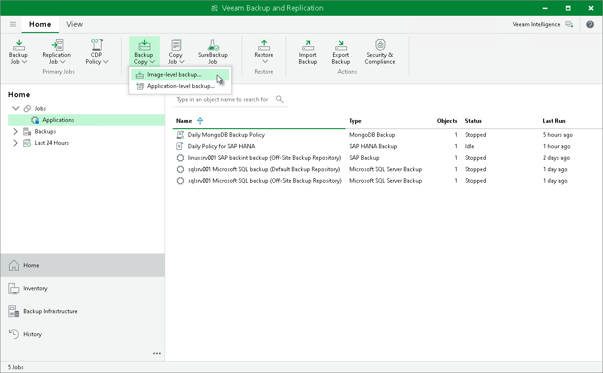

# Step 1. Launch Backup Copy Job Wizard

To create a backup copy job, do one of the following:

* If you do not have backups created with Veeam Plug-Ins, on the Home tab, click Backup Copy.
* If you have backups created with Veeam Plug-Ins, on the Home tab, click Backup Copy and click Image-level backup.

