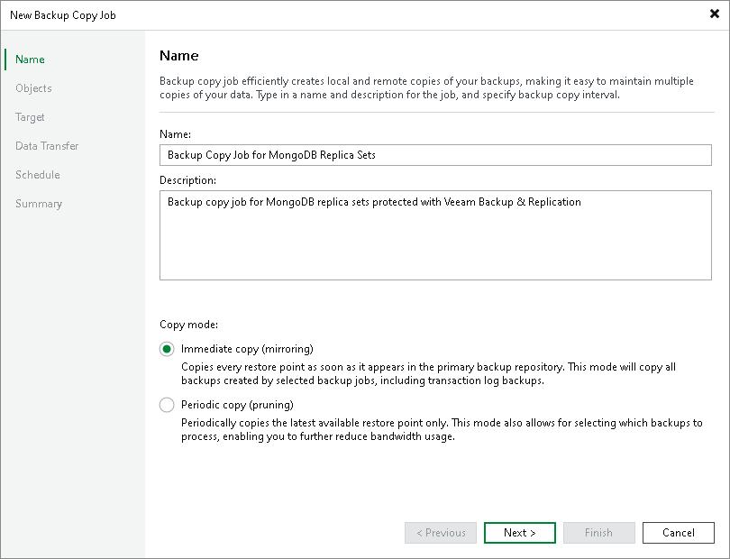

# Step 2. Specify Job Name and Description

At the Job step of the wizard, specify basic settings for the backup copy job:

1. In the Name field, specify a name for the job.
2. In the Description field, provide a description for the job.

The default description contains information on a user who created the job, date and time when the job was created.

1. Select a backup copy mode. For details on copy modes and backup types supported in each mode, see [Backup Copy Modes](backup_copy_modes.md).

* Select Immediate copy to copy new restore points as soon as they appear.

* Select Periodic copy to copy the most recent restore points.

