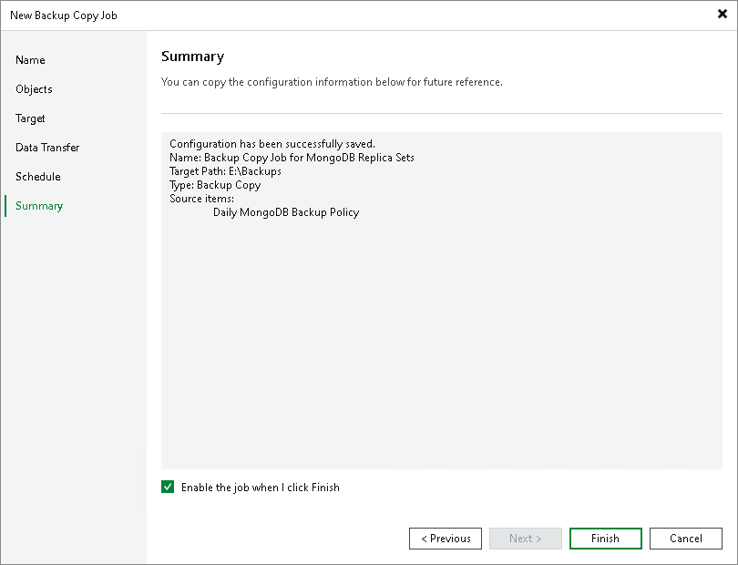

# Step 9. Review Backup Copy Job Settings

At the Summary step of the wizard, complete the procedure of backup copy job configuration:

1. Review details of the backup copy job.
2. Select the Run the job when I click Finish check box if you want to start the job right after you finish working with the wizard.
3. Click Finish to close the wizard.

