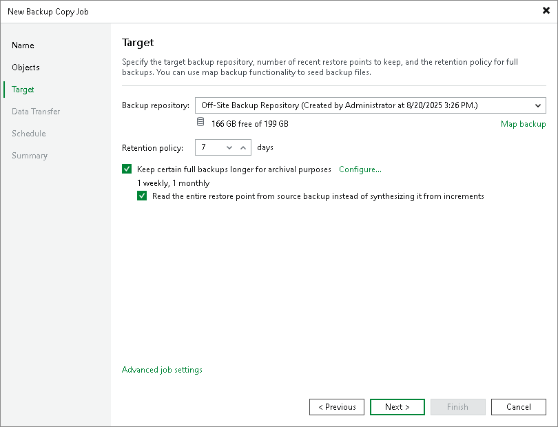

# Step 4. Define Backup Copy Target

At the Target step of the wizard, define a target backup repository and configure retention policy:

1. From the Backup repository list, select a backup repository where copied backups must be stored.

|  |
| --- |
| Important |
| If you plan to create backup copy job for a backup created with MongoDB Backup, you cannot select [Veeam Cloud Connect repository](https://helpcenter.veeam.com/docs/vbr/cloud/cloud_connect_configure_repository.html?ver=13) as a backup copy target. Otherwise, the backup copy process for MongoDB workloads will fail. |

1. In the Retention Policy field, configure the short-term retention policy for restore points:

* If you want to keep the last <N> restore points, select restore points from the drop-down list and specify the number of restore points.
* If you want to keep all restore points created during the last <N> days, select days from the drop-down list and specify the number of days.

When the specified number is exceeded, the earliest restore point will be removed from the backup chain or will be merged with the next closest restore point. For details on how Veeam Backup & Replication retains the desired number of restore points, see [Short-Term Retention Policy](backup_copy_simple_retention.md).

|  |
| --- |
| Note |
| If you enable the [GFS retention](backup_copy_gfs.md), the short-term retention policy will not be able to delete and merge the GFS backup files. Thus, the backup copy chain will have more restore points than specified in the short-term retention policy. |

1. If you want to create weekly, monthly and yearly full backups, you can configure long-term retention policy (GFS retention policy). GFS full backups will not be deleted or modified until the specified retention period expires. For details on the GFS retention policy and its limitations, see [Long-Term Retention Policy (GFS)](backup_copy_gfs.md).

To configure GFS retention policy, do the following:

1. Select the Keep certain full backups longer for archival purposes check box.
2. Click Configure.
3. In the Configure GFS window, select the necessary GFS backup options. You can configure Veeam Backup & Replication to create weekly, monthly and yearly restore points. For details on settings of the GFS retention, see [Backup Copy GFS Cycles](backup_copy_gfs_periods.md).

|  |
| --- |
| Note |
| Before you implement the GFS retention policy, see [Limitations and Considerations for GFS Retention Policy](backup_copy_considerations.md). |

1. You can define a way to create weekly, monthly and yearly full backups:

* Synthetic Full Method: With this method, during the GFS backup copy creation, Veeam Backup & Replication does not copy data from the source backup repository but synthesizes full backups from backup files that are already stored in the target backup repository. This approach helps to reduce load on the network and production environment.

The synthetic full method is used by default. To use this method, leave the Read the entire restore point from source instead of synthesizing it from increments option unselected.

* Active Full Method: With this method, Veeam Backup & Replication copies data for archive full backups from the source backup repository. This method decreases load on the target repository but increases load on the network and production environment.

To use this method, select the Read the entire restore point from source instead of synthesizing it from increments option.

