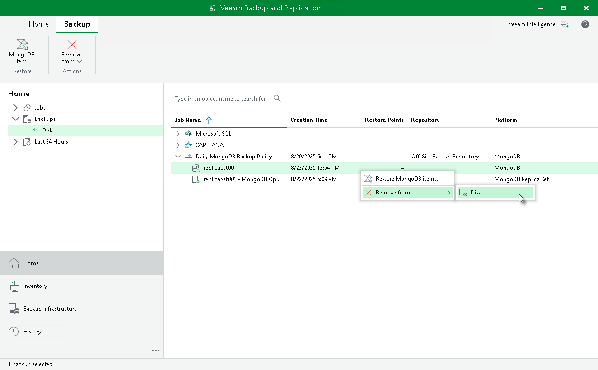
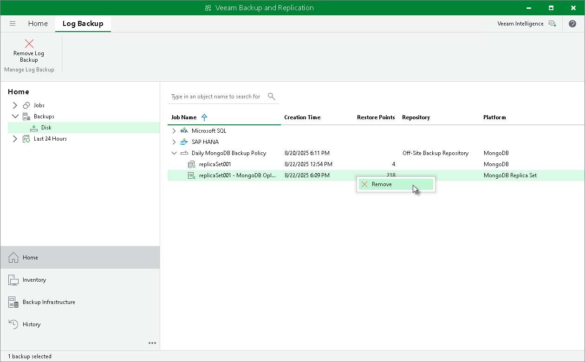

# Deleting Backup from Disk

Veeam Backup & Replication allows you to delete the following types of MongoDB Backups from the backup repository:

* [Data backup](#data)
* [Log backup](#log)

Deleting Data Backup from Disk

If you want to delete records about application backups from the Veeam Backup & Replication console and configuration database and, additionally, delete backup files from the backup repository, you can use the Remove from disk operation.

You can remove specific child backups — backups related to individual computers in the backup.

To remove an application backup from the backup repository:

1. Open the Home view.
2. In the inventory pane, click Backups.
3. In the working area, select the backup and click Remove from > Disk on the ribbon or right-click the backup and select Remove from > Disk.

Keep in mind that if you delete data backup files from the backup repository, Veeam Backup & Replication deletes log backup files too.

Deleting Log Backup from Disk

If you want to delete records about log backups from the Veeam Backup & Replication console and configuration database and, additionally, delete log backup files from the backup repository, you can use the Delete operation.

To remove a log backup from the backup repository:

1. Open the Home view.
2. In the inventory pane, click Backups.
3. In the working area, select the log backup and click Remove Log Backup on the ribbon or right-click the backup and select Remove.

Keep in mind that if you delete log backup files from the backup repository, Veeam Backup & Replication does not delete data backup files.

