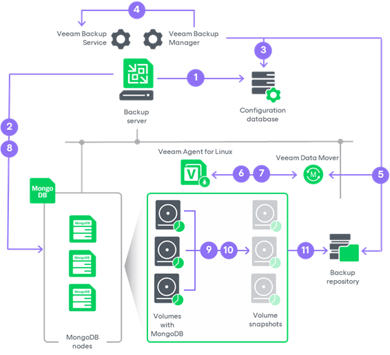

# Application Backup Policies

In this article

To back up MongoDB data with Veeam Backup & Replication, you must configure an application backup policy. With an application backup policy, you can instruct Veeam Backup & Replication to create MongoDB backups in a Veeam backup repository.

For the application backup policy, all policy management tasks are performed on the Veeam Backup & Replication server side: Veeam Backup & Replication starts the policy according to the defined schedule, allocates backup infrastructure resources, and so on. Veeam components running on a protected computer are controlled by Veeam Backup & Replication and perform data backup operations only. These operations include creating a volume snapshot, reading the backed-up data and transferring backed-up data to the target location. For more information, see [How Application Backup Policy Works](#hiw).

To configure an application backup policy, you must launch the New MongoDB Backup Policy wizard. Keep in mind that this is the only supported policy type for MongoDB backups, as Veeam Backup & Replication provides settings specific for MongoDB within this policy type. For more information, see [Creating Application Backup Policy](mongo_policy_create.md).

How Application Backup Policy for MongoDB Works

When you use an application backup policy to create MongoDB backups, Veeam Backup & Replication performs backup in the following way:

1. When you create an application backup policy in Veeam Backup & Replication, Veeam Backup & Replication saves the backup policy settings in its database.
2. If you set an application backup policy to process the oplog and create log backups, Veeam Backup & Replication creates a separate MongoDB log backup job for each replica set in a backup scope. For more information on how the log backup works, see [How MongoDB Log Backup Job Works](mongo_oplog_backup.md#hiw).
3. When a new backup policy session starts, Veeam Backup & Replication collects updated information about MongoDB nodes. During this step, Veeam Backup & Replication selects the backup source. For details, see [Backup Source Selection](mongo_rescan_job_db_detection.md).
4. Veeam Backup & Replication starts the Veeam Backup Manager process on the backup server. Veeam Backup Manager reads policy settings from the configuration database and creates a list of backup tasks to process.
5. Veeam Backup Manager connects to the Veeam Backup Service. The Veeam Backup Service includes a resource scheduling component that manages all tasks and resources in the backup infrastructure. The resource scheduler checks what backup infrastructure resources are available, and assigns backup repository to process the policy tasks.
6. Veeam Backup Manager connects to Veeam Transport Service on the backup repository. The Veeam Transport Service starts Veeam Data Mover. A new instance of Veeam Data Mover is started for every policy task.
7. Veeam Backup Manager establishes a connection with Veeam Agent for Linux that runs on the protected computer and Veeam Data Mover that runs on the backup repository, and sets a number of rules for data transfer, such as network traffic throttling rules, and so on.
8. Veeam Agent for Linux that runs on the protected computer and Veeam Data Mover that runs on the backup repository establish a connection with each other for data transfer.
9. Veeam Backup & Replication connects to protected computers, establishes a connection with Veeam Mongo Agent running on protected computers and collects MongoDB metadata.
10. Veeam Mongo Agent triggers a WiredTiger checkpoint.
11. Veeam Agent for Linux creates a snapshot of all volumes with MongoDB data, reads the backed-up data from the snapshots and transfers data to the backup repository.

To reduce the amount of data transferred and improve the performance of backups, Veeam Agent for Linux scans the computer disks, detects a MongoDB data directory (for example, /var/lib/mongodb) and includes only a disk with this directory into the backup scope.

While transporting backed-up data, Veeam Agent for Linux running on a protected computer performs additional processing. It filters out zero data blocks, blocks of swap files and blocks of excluded files and folders. Veeam Agent for Linux compresses backed-up data and transports it to the target Veeam Data Mover.

1. Veeam Backup & Replication stores backed-up data to the backup file in the backup repository.

Page updated 8/22/2025

Page content applies to build 13.0.1.1071
