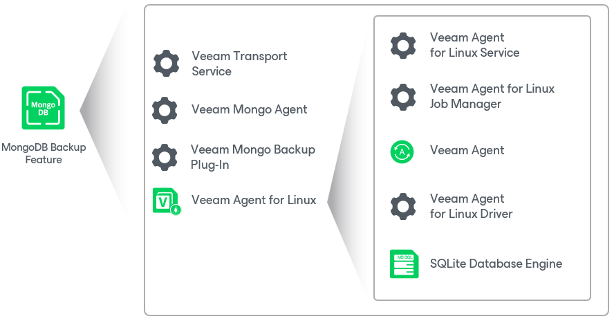

# Solution Architecture

When you rescan the MongoDB replica set (a group of instances that maintain the same data set) for the first time, Veeam Backup & Replication deploys the following Veeam components on each computer with the MongoDB primary daemon process (mongod) detected:

* Veeam Transport Service is a service responsible for connection between Veeam Backup & Replication and Veeam components running on the computer with MongoDB.
* Veeam Mongo Agent is a component that collects information about database hierarchy from the computer, communicates with mongo daemon for backup operations.

* Veeam Mongo Backup Plug-In is a component that detects the oplog collection and communicates with Veeam Mongo Agent to send the collection to the target repository. For details, see [Oplog Backup](mongo_oplog_backup.md).

* Veeam Agent for Linux is a component that backs up volumes with MongoDB data and sends the backup to the target repository.

Veeam Agent for Linux consists of the following components:

* Veeam Agent for Linux Service is a service responsible for managing all tasks and resources in Veeam Agent. The veeamservice component is registered as a daemon in the Linux OS upon the product installation. The service is started automatically when you start the OS and runs in the background.
* Veeam Agent for Linux Job Manager is a process started by Veeam Agent for Linux Service for every backup policy session.
* Veeam Agent that communicates with the Veeam Agent for Linux Service and Veeam Agent for Linux Job Manager. Veeam Agent is started by Veeam Agent for Linux Job Manager to perform data transfer operations of any kind: copy data from the backed-up volume to the backup location during backup, from the backup location to the target volume during restore, perform data compression, and so on.
* Veeam Agent for Linux Driver is a Veeam driver (Linux kernel module) used to create volume snapshots in the Linux OS and keep track of changed data blocks.
* To store its configuration data, Veeam Agent uses the SQLite database engine. SQLite requires only few files to install and takes little resources to run on a Linux OS.

