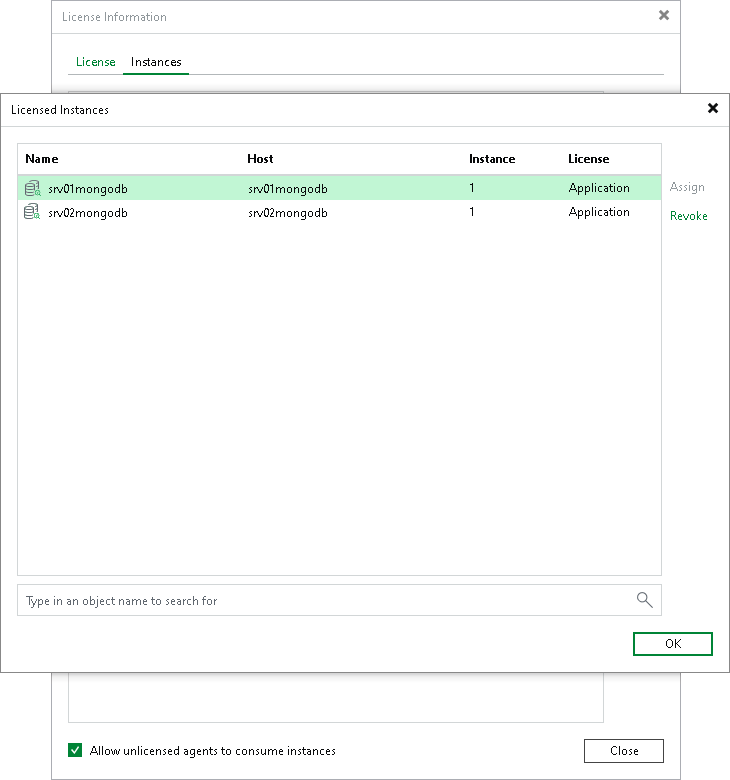

# Managing License

Veeam Backup & Replication automatically assigns a license instance to each computer added to a protected MongoDB Backup replica set. You cannot modify license use manually. However, you can restrict license consumption for specific machines to ensure only intended instances consume licenses.

|  |
| --- |
| Note |
| To run MongoDB backup jobs, select the Allow unlicensed agents to consume instances check box. When this option is enabled, Veeam Backup & Replication renews agent licenses during each backup job run by removing and reassigning them. This renewal logic ensures that licenses are correctly updated when the license is renewed on the Veeam Backup & Replication server. |

Restricting License Consumption for All Instances

To restrict instance consumption by all managed installed instances, do the following:

1. From the main menu, select License.
2. In the License Information window, click the Instances tab.
3. On the Instances tab, clear the Allow unlicensed agents to consume instances check box.
4. Click Close.

Restricting License Consumption for a Specific Instance

To restrict license use for a specific machine in a MongoDB Backup replica set, do the following:

1. From the main menu, select License.
2. In the License Information window, click the Instances tab.
3. In the Instances tab, click Manage.
4. In the Licensed Instances tab, select the installed instance and click Revoke.
5. Click OK and then click Close to close the windows.

