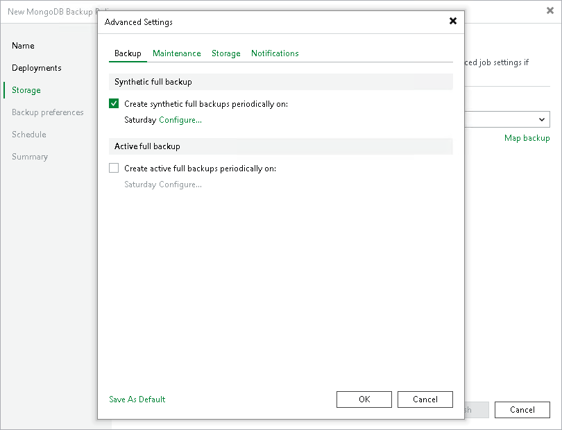

# Backup Settings

To specify settings for a backup chain created with the backup policy:

1. In the Advanced Settings window, click the Backup tab.
2. To define the schedule for synthetic full backups, select the Create synthetic full backups periodically on check box and click Configure. In the Schedule Settings window, define the schedule:

* To create a synthetic full backup once a month on specific days, select Monthly on. Use the fields on the right to configure the necessary schedule.
* To create a synthetic full backup once a week on specific week days, select Weekly. Use the fields on the right to select the necessary week days.

|  |
| --- |
| NOTE |
| Synthetic full backup is not available for application backup policies targeted at an object storage repository. |

1. To define the schedule for active full backups, select the Create active full backups periodically on check box and click Configure. In the Schedule Settings window, define the schedule:

* To create a active full backup once a month on specific days, select Monthly on. Use the fields on the right to configure the necessary schedule.
* To create a active full backup once a week on specific week days, select Weekly. Use the fields on the right to select the necessary week days.

