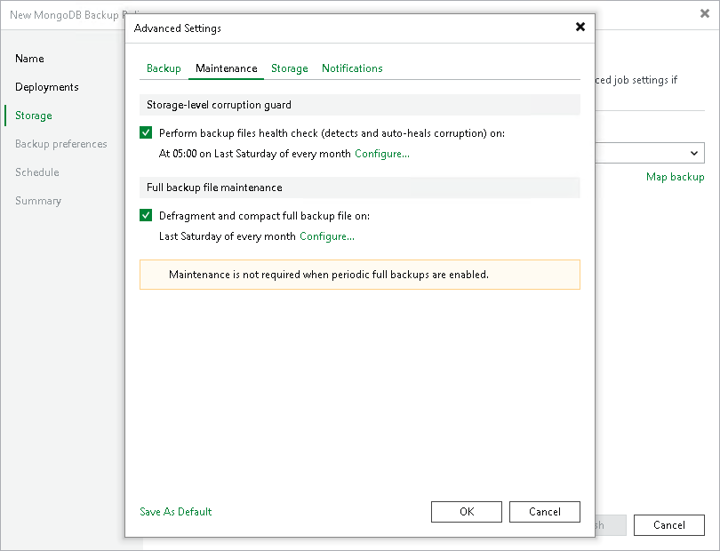

# Maintenance Settings

To specify maintenance settings for a backup chain created with the backup policy:

1. In the Advanced Settings window, click the Maintenance tab.
2. To periodically perform a health check for the latest restore point in the backup chain, in the Storage-level corruption guard section, select the Perform backup files health check check box and click Configure to specify the time schedule for the health check.

An automatic health check can help you avoid a situation where a restore point gets corrupted, making all dependent restore points corrupted, too. If during the health check Veeam Backup & Replication detects corrupted data blocks in the latest restore point in the backup chain (or the restore point before the latest one if the latest restore point is incomplete), it will start the health check retry and transport valid data blocks from the protected computer to the Veeam backup repository. The transported data blocks are stored to a new backup file or the latest backup file in the backup chain, depending on the data corruption scenario. For object storage, Veeam Backup & Replication offers a special health check mechanism as default. For details, see [Health Check for Object Storage Repositories](health_check_os.md).

1. To periodically compact a full backup, select the Defragment and compact full backup file check box and click Configure to specify the schedule for the compact operation.

|  |
| --- |
| Note |
| The Defragment and compact full backup file option is not available for application backup policies targeted at an object storage repository. |

During the compact operation, Veeam Backup & Replication creates a new empty file and copies to it data blocks from the full backup file. As a result, the full backup file gets defragmented and the speed of reading and writing from/to the backup file increases.

If the full backup file contains data blocks for deleted items (protection groups or individual computers), Veeam Backup & Replication removes these data blocks. For details, see [Compact of Full Backup File](backup_compact_file.md).

|  |
| --- |
| Note |
| Consider the following:   * If you want to periodically compact a full backup, you must make sure that you have enough free space in the target location. For the compact operation, the amount of free space must be equal to or more that the size of the full backup file. * In contrast to the compact operation for a VM backup, during compact of a full MongoDB backup file, Veeam Backup & Replication does not perform the data take out operation. If the full backup file contains data for a machine that has only one restore point and this restore point is older than 7 days, Veeam Backup & Replication will not extract data for this machine to a separate full backup file. |

