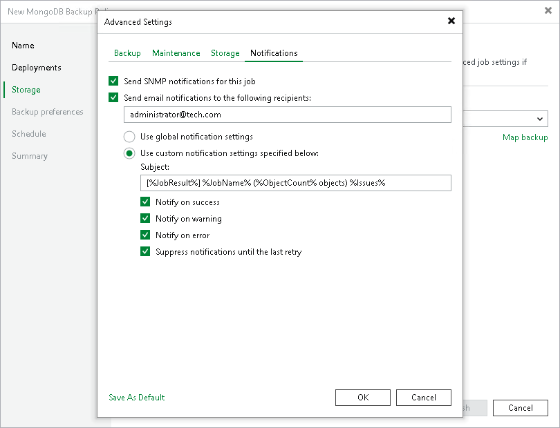

# Notification Settings

To specify notification settings for the backup policy:

1. In the Advanced Settings window, click the Notifications tab.
2. Select the Send SNMP notifications for this job check box if you want to receive SNMP traps when the policy completes successfully.

SNMP traps will be sent if you specify global SNMP settings in Veeam Backup & Replication and configure software on recipient's machine to receive SNMP traps. For details, see [Specifying SNMP Settings](snmp_settings.md).

1. Select the Send email notifications to the following recipients check box if you want to receive notifications about the job completion status by email. In the field below, specify a recipient email address. You can enter several addresses separated by a semicolon.

Email notifications will be sent if you configure global email notification settings in Veeam Backup & Replication. For details, see [Configuring Global Email Notification Settings](general_email_notifications.md).

1. You can choose to use global notification settings or specify custom notification settings.

* To receive a typical notification for the backup policy, select Use global notification settings. In this case, Veeam Backup & Replication will apply to the backup policy global email notification settings specified for the backup server. Veeam Backup & Replication will send the email report containing backup policy statistics at 8:00 AM daily.
* To configure a custom notification for the backup policy, select Use custom notification settings specified below. You can specify the following notification settings:

1. In the Subject field, specify a notification subject. You can use the following variables in the subject: %Time% (completion time), %JobName%, %JobResult%, %ObjectCount% (number of machines in the backup policy) and %Issues% (number of machines in the backup policy that have been processed with the Warning or Failed status).
2. Select the Notify on success, Notify on warning and Notify on error check boxes to receive email notification if the policy completes successfully, completes with a warning or fails.
3. Select the Suppress notifications until the last retry check box to receive a notification about the final job status. If you do not enable this option, Veeam Backup & Replication will send one notification per every job retry.

