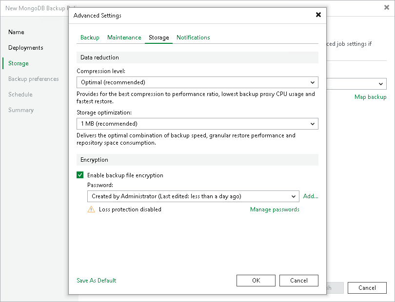

# Storage Settings

To specify compression settings for the backup policy:

1. In the Advanced Settings window, click the Storage tab.
2. From the Compression level list, select a compression level for the backup: None, Dedupe-friendly, Optimal, High or Extreme. For details on compression levels, see [Data Compression and Deduplication](compression_deduplication.md).
3. From the Storage optimization list, select what type of backup target you plan to use. Depending on the chosen storage type, Veeam Backup & Replication will use data blocks of different size to optimize the size of backup files and policy performance: 4 MB, 1 MB, 512 KB or 256 KB.
4. To encrypt the content of backup files, select the Enable backup file encryption check box. In the Password field, select a password that you want to use for encryption. If you have not created the password beforehand, click Add or use the Manage passwords link to specify a new password. For details, see [Password Manager](password_manager.md).

If the backup server is not connected to Veeam Backup Enterprise Manager, you will not be able to restore data from encrypted backups in case you lose the password. Veeam Backup & Replication will display a warning about it: Loss protection disabled. For details, see [Decrypting Backups With Enterprise Manager Keys](decrypt_without_pass.md).

You can also select a Key Management System (KMS) server in the Password field. The KMS server must be added to Veeam Backup & Replication in advance. If you choose to use KMS keys for backup file encryption at this step of the wizard, Veeam Backup & Replication immediately starts communication with the KMS server to retrieve the encryption keys. For details, see [Key Management System Keys](kms.md).

|  |
| --- |
| Note |
| Consider the following:   * If you plan to encrypt the content of backup files, see [Data Encryption Limitations](#limits). * You must encrypt the backup policy if you want to back up data to the storage in Veeam Data Cloud Vault. |

Data Encryption Limitations

If you plan to encrypt the content of backup files, consider the following limitations:

* Encryption is not retroactive. If you enable encryption for an existing backup policy, Veeam Backup & Replication will encrypt the backup chain starting from the next restore point created with this policy.
* If you enable encryption for an existing backup policy, during the next backup policy session Veeam Backup & Replication will create a full backup file. The created full backup file and subsequent incremental backup files in the backup chain will be encrypted with the specified password.

To learn more about data encryption in Veeam Backup & Replication, see [Data Encryption](data_encryption.md).

