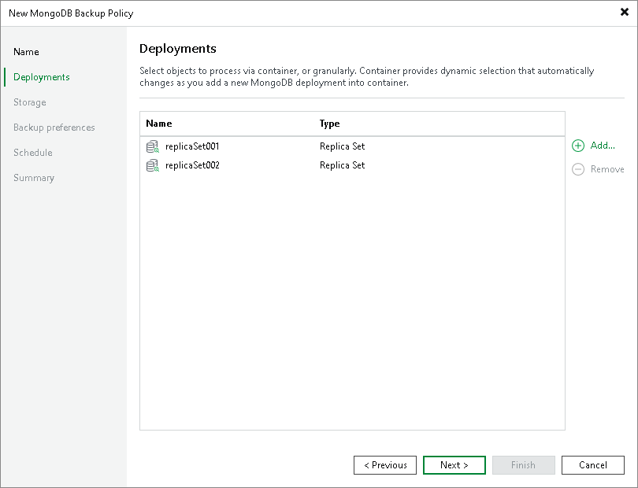

# Step 3. Specify Deployments

In this article

At the Deployments step of the wizard, select protection groups or replica sets whose data you want to back up.

You can add to the backup scope one or more objects added to inventory in the Veeam Backup & Replication console.

Application policies with protection groups are dynamic in their nature. If Veeam Backup & Replication discovers a new computer in a protection group after the policy is created, Veeam Backup & Replication will automatically update the policy settings to include the added computer.

Adding Objects from Inventory

To add objects to the application backup policy:

1. Click Add.
2. In the Select Objects window, select one or more objects in the list and click OK. You can select any of the following objects:

* Protection group
* MongoDB replica set

You can press and hold [Ctrl] to select multiple objects at once.

|  |
| --- |
| Note |
| In the Select Objects window, Veeam Backup & Replication shows only those computers on which Veeam Backup & Replication have detected MongoDB data during the rescan job. To learn more, see [Rescan Job](mongo_rescan_job.md). |

To quickly find the necessary object, use the search field at the bottom of the Select Objects window.

1. Enter the object name or a part of it in the search field.
2. Click the Start search button on the right or press [Enter].

Page updated 11/21/2024

Page content applies to build 13.0.1.1071
