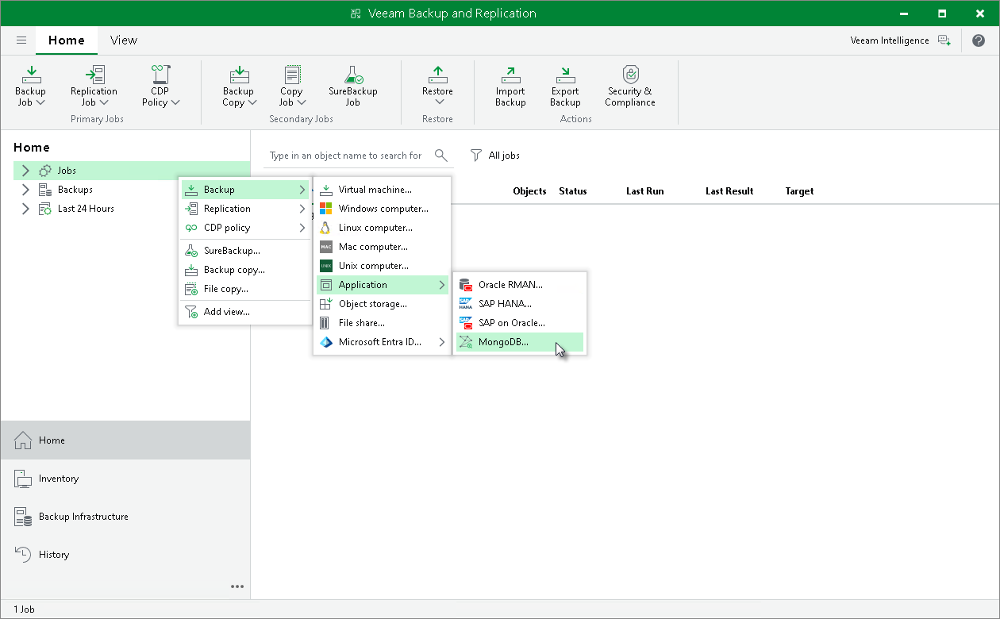

# Step 1. Launch New Application Backup Policy Wizard

To create an application policy for MongoDB, you must launch the New MongoDB Backup Policy wizard. To do this, on the Home tab, click Backup > Application > MongoDB.

