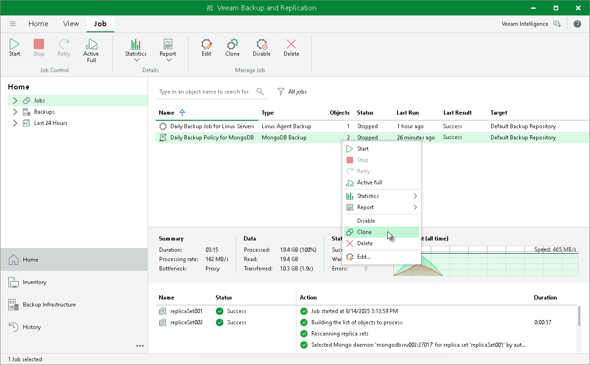

# Cloning Backup Policy

You can clone application backup policies configured in Veeam Backup & Replication. For example, you may want to configure a backup policy that will be used as a template, and use this policy to create multiple policies with similar settings.

To clone a backup policy:

1. Open the Home view.
2. In the inventory pane, select Jobs.
3. In the working area, select the backup policy and click Clone on the ribbon or right-click the backup policy and select Clone.
4. After a backup policy is cloned, you can edit all its settings, including the policy name.

