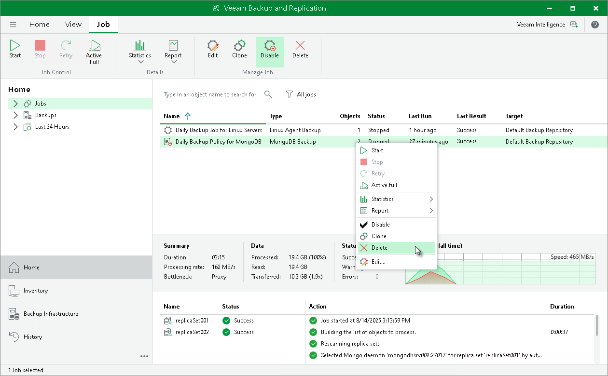

# Deleting Backup Policy

In this article

You can permanently remove a disabled application backup policy from Veeam Backup & Replication. Backups created by this backup policy remain on the target location.

To remove an application backup policy:

1. Open the Home view.
2. In the inventory pane, select Jobs.
3. In the working area, select the application backup policy and click Disable on the ribbon or right-click the policy and select Disable.
4. Wait for Veeam Backup & Replication to disable the application backup policy, then select the backup policy and click Delete on the ribbon or right-click the policy and select Delete.

After the job is deleted, the backups created by this job are displayed under the Backups > Disk (Orphaned) node. In certain cases, the backups can be displayed in other nodes:

* In case of capacity tier, the backups are displayed under the Backups > Capacity Tier (Orphaned) node in the inventory pane.
* In case of object storage, the backups are displayed under the Backups > Object Storage (Orphaned) node in the inventory pane.

Page updated 11/26/2025

Page content applies to build 13.0.1.1071
