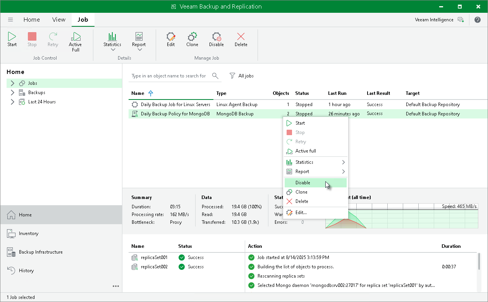

# Enabling and Disabling Backup Policy

In this article

You can temporarily disable scheduled application backup policies configured in Veeam Backup & Replication. When you disable a job, Veeam Backup & Replication does not start the job by the specified schedule. Also, if you have a MongoDB log backup job running, Veeam Backup & Replication stops this job. You can start a disabled job manually at any time you need. You can also enable a disabled job at any time.

To disable an application backup policy:

1. Open the Home view.
2. In the inventory pane, select Jobs.
3. In the working area, select the application backup policy and click Disable on the ribbon or right-click the policy and select Disable.

If you disabled a backup policy in the Veeam Backup & Replication console, this backup policy will not start by schedule. Also, if you have a MongoDB log backup job running, Veeam Backup & Replication stops this job.

To enable a disabled policy, select it in the list and click Disable on the ribbon once again.

Page updated 9/2/2025

Page content applies to build 13.0.1.1071
