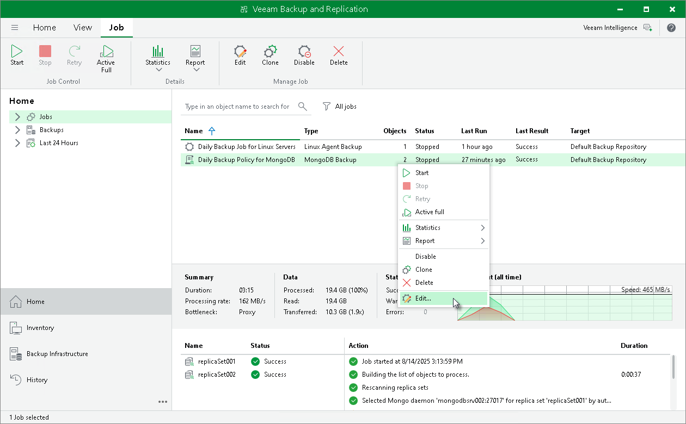

# Editing Backup Policy Settings

In this article

You can edit settings of an application backup policy at any time. For example, you may want to change the backup scope, target location or scheduling settings for application backup policies running on protected computers.

|  |
| --- |
| NOTE |
| If you want to change a backup repository, you must disable a policy. To learn more, see [Enabling and Disabling Backup Policy](mongo_policy_manage_disable.md). In this case during the next run the policy will produce a full backup. |

To edit backup policy settings:

1. Open the Home view.
2. In the inventory pane, select Jobs.
3. In the working area, select the backup policy and click Edit on the ribbon or right-click the policy and select Edit.
4. Complete the steps of the Edit Application Backup Policy wizard to change the policy settings as required.

Page updated 11/27/2024

Page content applies to build 13.0.1.1071
