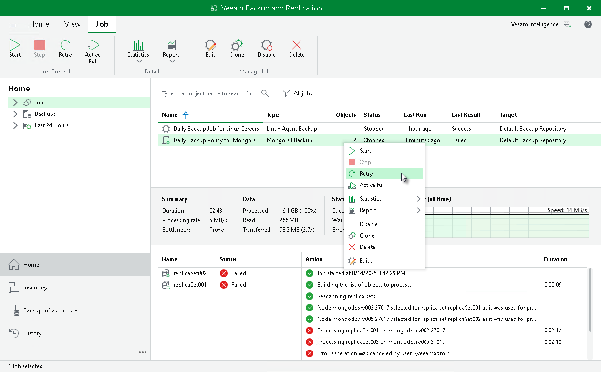

# Retrying Backup Policy

You can manually retry an application backup policy configured in Veeam Backup & Replication if the policy failed during the previous policy session. When you retry a backup policy, Veeam Backup & Replication processes only those computers in the policy that were not processed successfully during the previous policy session.

To retry a policy:

1. Open the Home view.
2. In the inventory pane, select Jobs.
3. In the working area, select the application backup policy and click Retry on the ribbon or right-click the policy and select Retry.

