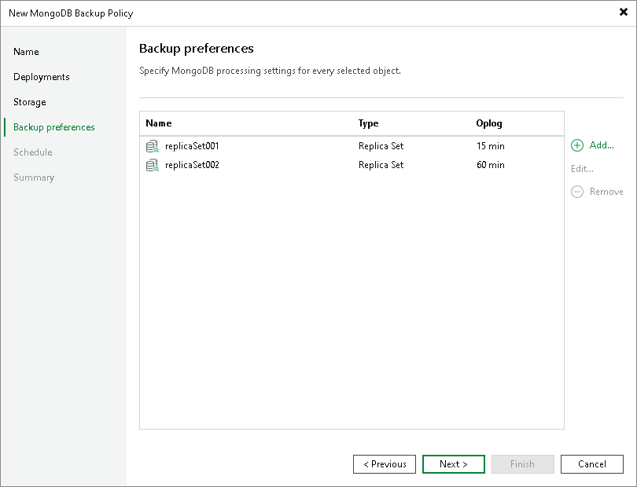

# Step 6. Specify Backup Preferences

At the Backup Preferences step of the wizard, specify processing settings for the nodes of the replica set you plan to back up:

1. Select the object and click Edit.
2. Specify processing settings for the objects in the list. To learn more, see [Processing settings](mongo_policy_preferences_processing.md).

In the list, Veeam Backup & Replication shows only those objects that you added to the backup scope at the Deployments step of the wizard. If you added a protection group, but need to specify settings for an individual replica set in this protection group, you can add such object to the list. To learn more, see [Adding Objects from Backup Scope](#add).

Adding Objects from Backup Scope

To add replica sets to the Credentials list:

1. Click Add.
2. In the Select Objects window, select one or more replica sets in the list and click OK.

You can press and hold [Ctrl] to select multiple objects at once.

To quickly find the necessary replica set, use the search field at the bottom of the Select Objects window.

1. Enter the replica set name or a part of it in the search field.
2. Click the Start search button on the right or press [Enter].

