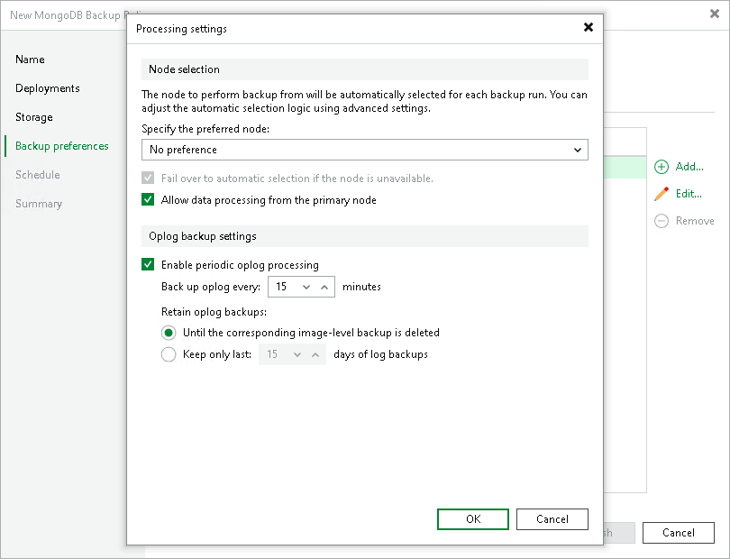

# Processing Settings

To specify processing settings:

1. At the Backup Preferences step of the wizard, select the object and click Edit.

1. In the Specify the preferred node field, you can specify which node Veeam Backup & Replication must prefer as a backup source. To do so, do one of the following:

* Select the No preference option if you want Veeam Backup & Replication to prefer secondary nodes of a replica set that correspond to requirements described in [Backup Source Selection](mongo_rescan_job_db_detection.md).

* Select the node in the drop-down list if you want Veeam Backup & Replication to prefer a certain node of a replica set. The drop-down list contains all computers that you added to the backup scope at the [Computers](mongo_protection_group_scope_computers.md) step of the New Protection Group wizard.

If you specified the preferred node but this node becomes unhealthy or unreachable, you can instruct Veeam Backup & Replication to switch to the automatic node selection. To do so, select the Fail over to automatic selection if the specified node becomes unavailable check box.

1. By default, Veeam Backup & Replication backs up data from a selected secondary node of a replica set. If this node becomes primary, Veeam Backup & Replication selects another secondary node. If you want Veeam Backup & Replication to back up data from the primary node, select the Allow data processing from the primary node check box. In this case, Veeam Backup & Replication will continue backing up data from the node even if it becomes a primary member of a replica set.

1. Select Enable periodic oplog processing if you want Veeam Backup & Replication to create regular operations log (oplog) backups. The oplog backup contains records of operations that modified MongoDB data and allows you to restore instances or collections to a certain point in time between backup policy runs. To learn more, see [Oplog Backup](mongo_oplog_backup.md).

If you want to create oplog backups, specify the following settings:

1. In Back up oplog every N minutes, specify a time interval, in minutes, at which Veeam Backup & Replication creates oplog backups. By default, Veeam Backup & Replication creates oplog backups every 15 minutes.

Keep in mind if you specify a shorter interval, Veeam Backup & Replication creates more oplog backups that require more storage space.

1. Specify retention policy for oplog backups:

1. Select Until the corresponding image-level backup is deleted to store oplog backups only together with the data backup used as their starting point. When the data backup is deleted, Veeam Backup & Replication deletes these oplog backups too.

1. Select Keep only last N days of log backups to keep oplog backups created during a certain period of time. Then specify the number of days for which you want to store backup files. After the period, in days, is over, Veeam Backup & Replication deletes oplog backups.

When configuring retention policy for oplog backups in days, keep in mind retention policy for data backup specified at the [Storage](mongo_policy_storage.md) step. Retention policy for oplog backups must be equal or shorter than the retention policy for data backups.

