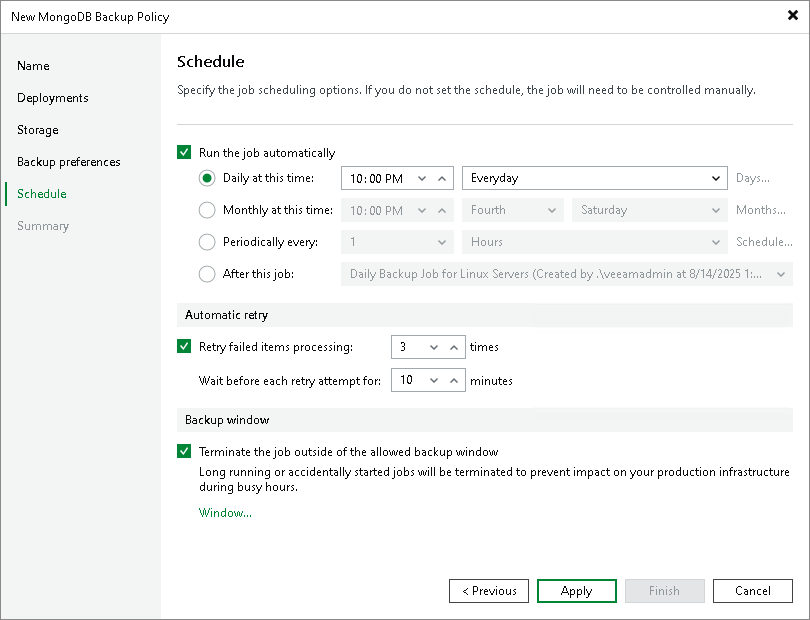

# Step 7. Specify Policy Schedule

At the Schedule step of the wizard, specify the schedule according to which you want to perform backup.

To specify the policy schedule:

1. Select the Run the job automatically check box. If this check box is not selected, you will have to start the backup policy manually to create backup.
2. Define scheduling settings for the policy:

* To run the policy at specific time daily, on defined week days or with specific periodicity, select Daily at this time. Use the fields on the right to configure the necessary schedule.
* To run the policy once a month on specific days, select Monthly at this time. Use the fields on the right to configure the necessary schedule.

* To run the policy repeatedly throughout a day with a specific time interval, select Periodically every. In the field on the right, select the necessary time unit: Hours or Minutes.

* To define the permitted time window for the policy, click Schedule and use the time table. In the Start time within an hour field, specify the exact time when the policy must start.

A repeatedly run policy is started by the following rules:

* The defined interval always starts at 12:00 AM. For example, if you configure to run a policy with a 4-hour interval, the policy will start at 12:00 AM, 4:00 AM, 8:00 AM, 12:00 PM, 4:00 PM and so on.

* If you define permitted hours for the policy, after the denied interval is over, the policy will start immediately and then run by the defined schedule.

For example, you have configured a policy to run with a 2-hour interval and defined permitted hours from 9:00 AM to 5:00 PM. According to the rules above, the policy will first run at 9:00 AM, when the denied period is over. After that, the policy will run at 10:00 AM, 12:00 PM, 2:00 PM and 4:00 PM.

* To chain jobs and policies, use the After this job field. In the common practice, jobs start one after another: when item A finishes, item B starts and so on. If you want to create a chain of items, you must define the time schedule for the first item in the chain. For the rest of the items in the chain, select the After this job option and choose the preceding item from the list.

|  |
| --- |
| NOTE |
| The After this job option will automatically start a job if the first job in the chain is started automatically by schedule. If you start the first job manually, Veeam Backup & Replication will display a notification. You will be able to choose whether Veeam Backup & Replication must start the chained job as well. |

1. In the Automatic retry section, define whether Veeam Backup & Replication must attempt to run the backup policy again if the policy fails for some reason. Enter the number of attempts to run the policy and define time intervals between them.
2. In the Backup window section, define the time interval within which the backup policy must complete. The backup window prevents the policy from overlapping with production hours and ensures that the policy does not impact performance of your server. To set up a backup window for the policy:

1. Select the Terminate job if it exceeds allowed backup window check box and click Window.
2. In the Time Periods window, define the allowed hours and prohibited hours for backup. If the policy exceeds the allowed window, it will be automatically terminated.

|  |
| --- |
| NOTE |
| If you configure a backup policy, after you click Apply at the Schedule step of the wizard, Veeam Backup & Replication will immediately apply the backup policy to protected computers. |

