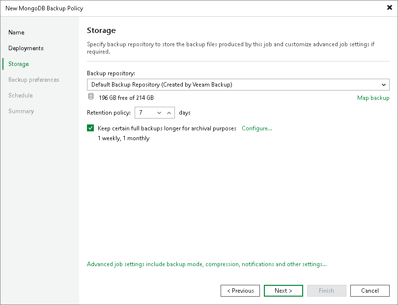

# Step 4. Specify Storage Settings

At the Storage step of the wizard, specify settings for the target backup repository:

1. From the Backup repository list, select a backup repository where you want to store backups. You can select from the Veeam backup repositories configured on the backup server that will manage the created backup policy.
2. You can map the policy to a specific backup stored on the backup repository. Backup job mapping can be helpful if you have moved backup files to a new backup repository and want to point the policy to existing backups on this new backup repository. You can also use backup job mapping if the configuration database got corrupted and you need to reconfigure backup jobs.

To map the job to a backup, click the Map backup link and select the backup on the backup repository. Backups can be easily identified by policy names. To find the backup, you can also use the search field at the bottom of the window.

|  |
| --- |
| Note |
| You can map an application backup policy for MongoDB only to backups created with another application backup policy for MongoDB. You cannot map your policy to backups created with other types of backup policies or jobs. |

1. In the Retention Policy field, specify the number of days for which you want to store backup files in the target location. By default, Veeam Backup & Replication keeps backup files for 7 days. After this period is over, Veeam Backup & Replication will remove the earliest restore points from the backup chain.
2. To use the GFS (Grandfather-Father-Son) retention scheme, select the Keep certain full backups longer for archival purposes check box and click Configure. In the Configure GFS window, specify how weekly, monthly and yearly full backups must be retained. For details, see [Long-Term Retention Policy (GFS)](backup_copy_gfs.md).
3. Click Advanced job settings... to specify advanced settings for the backup policy. To learn more, see [Specify Advanced Backup Settings](mongo_policy_advanced.md).

