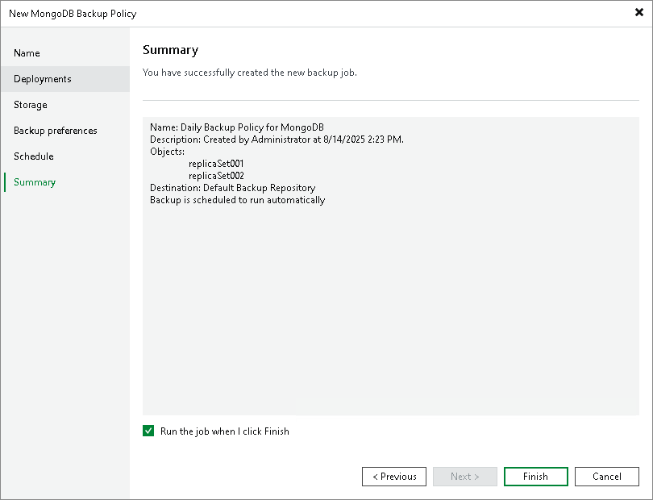

# Step 8. Review Policy Settings

At the Summary step of the wizard, complete the configuration process for the application backup policy.

1. Review settings of the configured backup policy.
2. Select the Run the job when I click Finish check box if you want to enable the policy right after you finish working with the wizard. After that, you can start the policy manually or wait for the scheduled start.
3. Click Finish to close the wizard.

