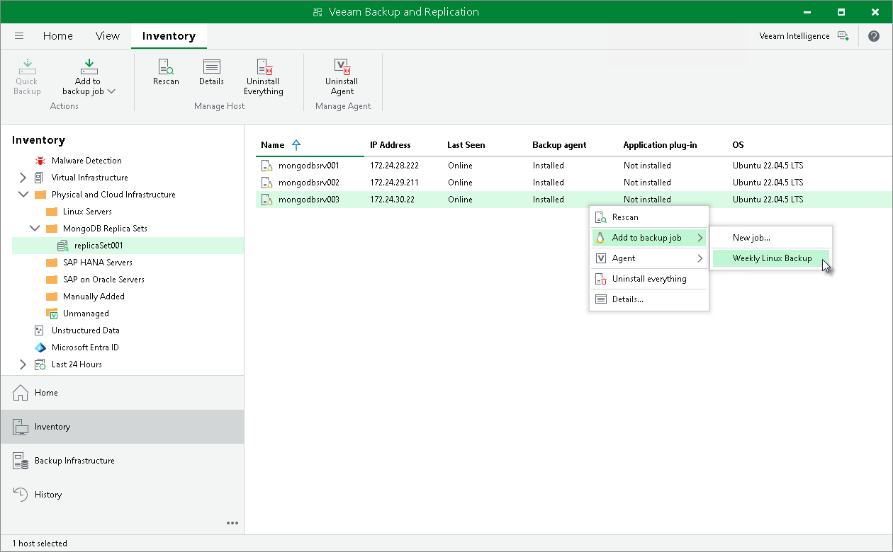

# Adding Computer to Veeam Agent Backup Job

In this article

You can add a specific protected computer to a Veeam Agent backup job that you have configured in Veeam Backup & Replication. This may be useful if you want to create an image-level backup of the protected computer with Veeam Agent for Linux in addition to the application-level backup of MongoDB data. To learn more about Veeam Agent backup jobs, see [Adding Computer to Backup Job](agents_protected_computers_add.md).

To add a protected computer to a Veeam Agent backup job:

1. Open the Inventory view.
2. In the inventory pane, in the Physical Infrastructure node, select a protection group whose computers you want to add to a Veeam Agent backup job and do one of the following:

* In the working area, select the computer that you want to add to the job and click Add to backup job > name of the job on the ribbon.
* In the working area, right-click the computer that you want to add to the job and select Add to backup job > name of the job.

|  |
| --- |
| Note |
| Consider the following:   * You can add a computer to a Veeam Agent backup job configured for computers of the same platform. For example, you can add a Linux computer only to a Veeam Agent backup job for Linux computers. * You can also add a specific protected computer to a new backup job. To learn more, see [Working with Veeam Agent Backup Jobs and Policies](backup_job_tasks.md). |

Page updated 9/2/2025

Page content applies to build 13.0.1.1071
