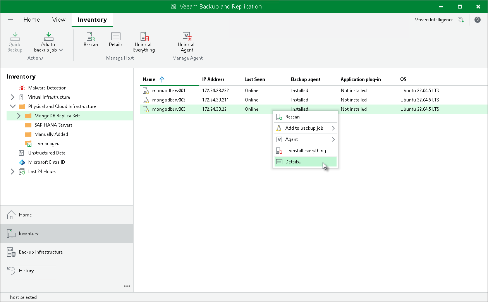

# Viewing Properties

You can view detailed information about protected computers. The detailed information provides the following data:

* Host name
* IP address
* Fingerprint (for computers running a Linux OS)
* Key algorithm (for computers running a Linux OS)
* Operating system
* Veeam product version

To view detailed information about a protected computer:

1. Open the Inventory view.
2. In the inventory pane, expand the Physical Infrastructure node.
3. In the working area, select the computer and click Details on the ribbon or right-click the computer and select Details.

