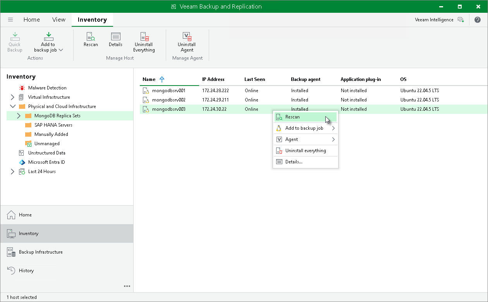

# Rescanning Protected Computer

You can rescan protected computers added to the inventory. The rescan operation may be required, for example, if you want to refresh information about the protected computer in the Veeam Backup & Replication database. During the rescan operation, Veeam Backup & Replication communicates to Veeam Installer Service running on the protected computer, retrieves information about the computer and stores this information to the configuration database.

To rescan a protected computer:

1. Open the Inventory view.
2. In the inventory pane, expand the Physical Infrastructure node and select the necessary protection group.
3. In the working area, select the computer and click Rescan on the ribbon or right-click the computer and select Rescan.

