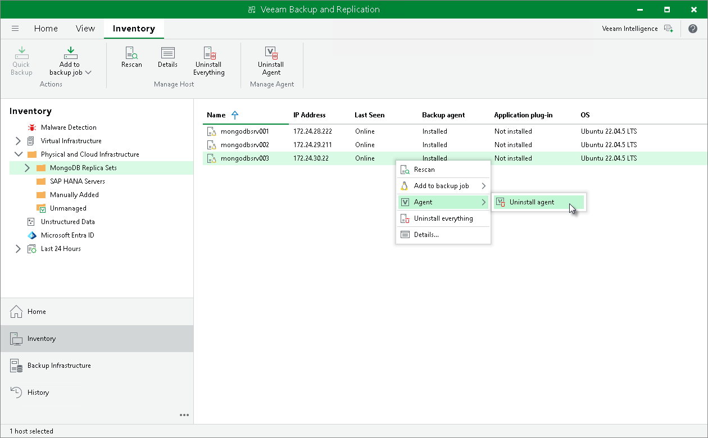

# Uninstalling Veeam Agent

In this article

You can remove Veeam Agent from a specific protected computer, for example, if you want to reinstall Veeam Agent running on the protected computer.

To uninstall Veeam Agent:

1. Open the Inventory view.
2. In the inventory pane, expand the Physical Infrastructure node and select the necessary protection group.
3. In the working area, select the necessary computer and click Uninstall agent on the ribbon or right-click the computer and select Agent > Uninstall and select Veeam Agent you want to uninstall.
4. In the displayed notification window, click Yes.

|  |
| --- |
| NOTE |
| Consider the following:   * If automatic installation of Veeam Agent is enabled in the protection group settings, after you remove Veeam Agent from a selected computer, Veeam Backup & Replication will install Veeam Agent on this computer during the next rescan job session started by schedule. * Prerequisite components installed and used by MongoDB Backup are not removed during the uninstall process. To remove the remaining components, use the built-in tools directly on this computer. |

Page updated 4/4/2025

Page content applies to build 13.0.1.1071
