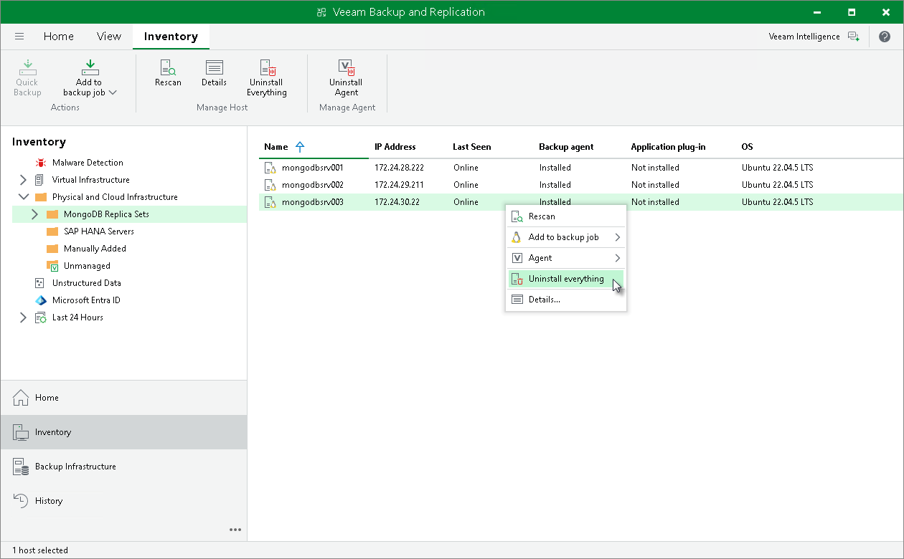

# Uninstalling Veeam Components

In this article

You can uninstall all the following Veeam product components installed on a protected computer as one operation:

* Veeam Agents
* Veeam Plug-Ins
* Veeam Deployer Service
* Veeam Transport Service

This approach is helpful if several products are installed on the protected computer, and you do not want to uninstall the products individually.

|  |
| --- |
| Tip |
| * To learn about Veeam Agents, see [Veeam Agent Backup](agents_introduction.md). * For details on Veeam Plug-Ins, Veeam Installer Service, Veeam Deployer Service and Veeam Transport Service, see [Veeam Plug-In Management Infrastructure](management_infrastructure.md#agent). |

Before you start the uninstall process, consider the following:

* Veeam Deployer Service and Veeam Transport Service are not removed from the computer with Veeam Plug-In if the computer is added to the Veeam backup infrastructure as a managed server. For details, see [Virtualization Servers and Hosts](setup_add_server.md).
* Veeam Deployer Service is not removed if Veeam Backup & Replication connects to the protected computer with single-use credentials.
* Prerequisite components installed and used by Veeam Products are not removed during the uninstall process. To remove the remaining components, use the built-in tools directly on this computer.

To uninstall Veeam Agents, Veeam Plug-Ins and other Veeam product components:

1. Open the Inventory view.
2. In the inventory pane, expand the Physical Infrastructure node and select the necessary protection group.
3. In the working area, select the necessary computer and click Uninstall Everything on the ribbon or right-click the computer and select Uninstall everything.
4. In the displayed notification window, click Yes.

Page updated 9/2/2025

Page content applies to build 13.0.1.1071
