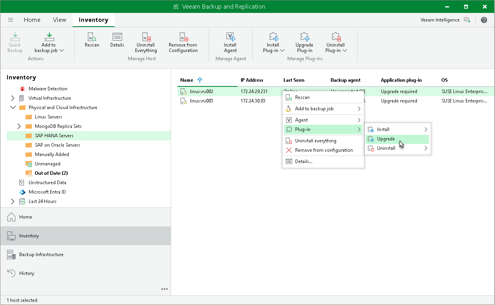
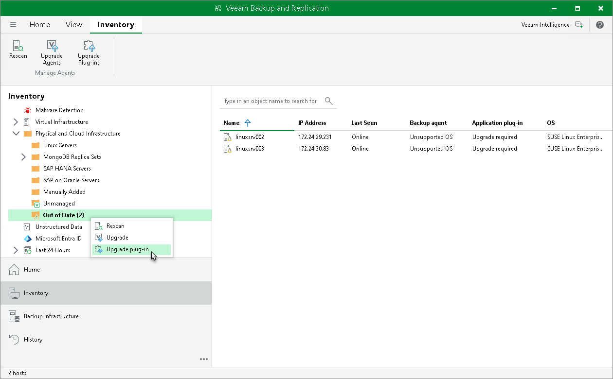

# Upgrading Veeam Agent

Periodically, Veeam releases a new version of Veeam Backup & Replication that contains new features and bug fixes. The release package also contains a new version of Veeam Plug-Ins.

Veeam Backup & Replication 13 supports different versions of Veeam Plug-In depending on which OS is running on the backup server:

* Veeam Backup & Replication on Linux supports management of Veeam Plug-Ins 13. Management of previous versions of Veeam Plug-Ins is not supported.
* Veeam Backup & Replication on Microsoft Windows supports management of Veeam Plug-Ins 12.3.2.4165 and later.

Note that Veeam Backup & Replication must be the same or later than the version of Veeam Plug-In. If you want to use the latest functionality, you must upgrade both Veeam Backup & Replication and Veeam Plug-In to the latest version. If you use an earlier Veeam Plug-In build, it may not have all the features and bug fixes introduced in your Veeam Backup & Replication version. To learn more about the Veeam Plug-In builds included in Veeam Backup & Replication installation ISO files, see [this Veeam KB article](https://www.veeam.com/kb4474).

In the Veeam Backup & Replication console, you can upgrade Veeam Agents on the computers that are added to a protection group for MongoDB.

From the Veeam Backup & Replication console, you can upgrade Veeam Agent on a protected computer in two ways:

* Automatically — You can use this method to upgrade all outdated Veeam Agents on computers in a protection group. To enable automatic update, select the Auto-update backup agents option in the protection group settings. For more information, see [Specify Discovery and Deployment Options](mongo_protection_group_options.md).
* Manually — You can upgrade Veeam Agent on an individual computer in a protection group. This method may be required, for example, if you did not allow Veeam Backup & Replication to automatically upgrade Veeam Agent on computers included in the protection group and want to test the upgrade process on a selected computer first.

Before You Begin

Before you upgrade Veeam Agent, verify the following:

* The protected computer is powered on and able to be connected over the network.
* There are no running application policies.

We recommend that you do not stop running application policies and let them complete successfully. Disable any periodic jobs temporarily to prevent them from starting during the upgrade.

|  |
| --- |
| TIP |
| During the protected computers discovery process, Veeam Backup & Replication checks the version of Veeam Agent running on a protected computer and the version of Veeam Agent available on the distribution server. If a newer version of Veeam Agent becomes available on the distribution server, and automatic upgrade of Veeam Agent is disabled for a protection group, Veeam Backup & Replication puts a computer to the Upgrade required state.  In addition, Veeam Backup & Replication includes computers that require upgrade of Veeam Agent in the Out of Date protection group. You can upgrade Veeam Agent on all computers that require upgrade at once. To learn more, see [Upgrading Veeam Agents Automatically](#multiple). |

Upgrading Veeam Agents Automatically

You can upgrade Veeam Agent on all computers that require upgrade at once. To upgrade Veeam Agent on protected computers:

1. Open the Inventory view.
2. In the inventory pane, in the Physical Infrastructure node, select the Out of Date protection group and click Upgrade Agents on the ribbon or right-click the Out of Date protection group and select Upgrade.

|  |
| --- |
| NOTE |
| In some cases, upgrade to the new version of Veeam Plug-In may require computer reboot. |

Upgrading Veeam Agent Manually

To upgrade Veeam Agent manually on a certain protected computer:

1. Open the Inventory view.
2. In the inventory pane, expand the Physical Infrastructure node and select the necessary protection group.
3. In the working area, select the necessary computer and click Upgrade agent on the ribbon or right-click the computer and select Agent > Upgrade agent.

|  |
| --- |
| NOTE |
| In some cases, upgrade to the new version of Veeam Plug-In may require computer reboot. |

