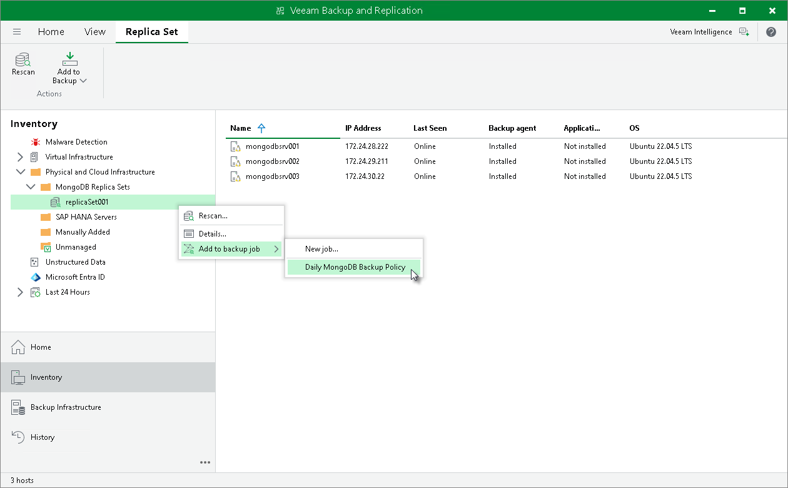

# Adding Replica Set to Application Backup Policy

In this article

To add a replica set to an application backup policy:

1. Open the Inventory view.
2. In the inventory pane, expand the Physical Infrastructure node and do one of the following:

* In the inventory pane, select the replica set that you want to add to the backup policy and click Add to Backup > name of the policy on the ribbon.
* In the inventory pane, right-click the replica set that you want to add to the backup policy and select Add to backup job > name of the policy.

|  |
| --- |
| Note |
| You can also add a replica set to a new application backup job. To learn more, see [Creating Protection Group for MongoDB](protection_group_create_mongo.md). |

Page updated 12/20/2024

Page content applies to build 13.0.1.1071
