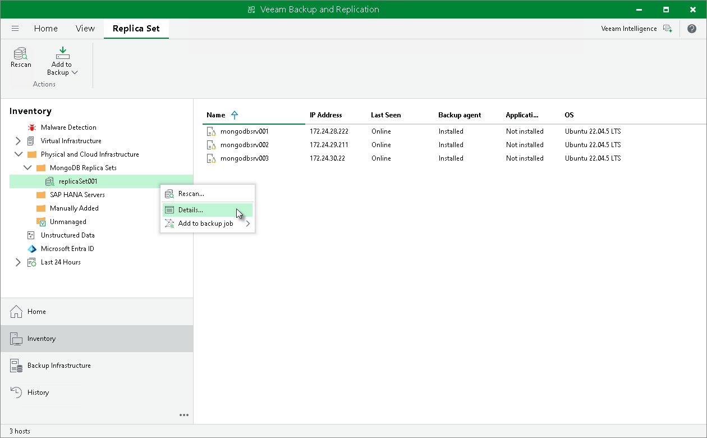

# Viewing Properties

In this article

You can view detailed information about protected replica sets. The detailed information provides the following data:

* Replica set connection parameters (DNS name, NetBIOS name or IP address and port number)
* MongoDB version
* Date and time of the last successful rescan job

To view detailed information about a protected replica set:

1. Open the Inventory view.
2. In the inventory pane, expand the Physical Infrastructure node and select the necessary protection group.
3. In the inventory pane, select the replica and click Details on the ribbon or right-click the replica set and select Details.

Page updated 12/20/2024

Page content applies to build 13.0.1.1071
