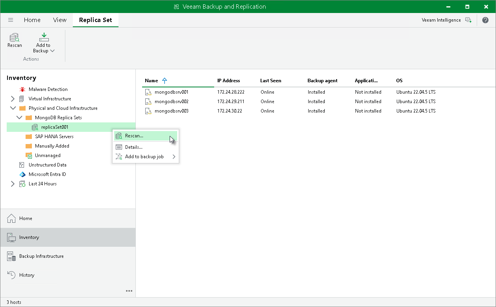

# Rescanning Protected Replica Set

In this article

You can rescan protected replica sets added to the inventory. The rescan operation may be required, for example, if you want to refresh information about the replica set in the Veeam Backup & Replication database. During the rescan operation, Veeam Backup & Replication communicates with a MongoDB replica set and collects information about the replica set and computers in the replica set. Then, Veeam Backup & Replication stores all the collected information in the configuration database.

To rescan a protected computer:

1. Open the Inventory view.
2. In the inventory pane, expand the Physical Infrastructure node and select the necessary protection group.
3. In the inventory pane, select the replica set and click Rescan on the ribbon or right-click the replica set and select Rescan.

Page updated 12/20/2024

Page content applies to build 13.0.1.1071
