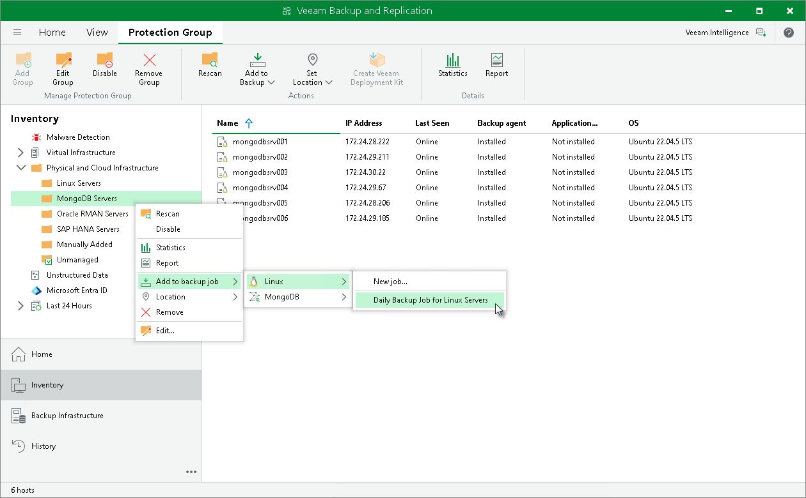

# Adding Protection Group to Veeam Agent Backup Job

You can add a protection group for MongoDB to a Veeam Agent backup job that you have configured in Veeam Backup & Replication. This may be useful if you want to create an image-level backup of the protected computer with Veeam Agent for Linux instead of an application-level backup of MongoDB data. To learn more about Veeam Agent backup jobs, see [Adding Computer to Backup Job](agents_protected_computers_add.md).

|  |
| --- |
| Important |
| You cannot simultaneously back up the same computer with an application backup policy for MongoDB and a Veeam Agent backup policy. If you plan to create a Veeam Agent backup policy for the computer and MongoDB data on this computer is already protected with an application-level backup, delete this computer from the backup scope of the application-level backup. For details, see [Editing Protection Group Settings](mongo_protection_group_edit.md).  Alternatively, if you need to create an image-level backup of a node in a MongoDB replica set, you can exclude this node from the backup scope of the protection group for MongoDB. In this case it can be backed-up with Veeam Agent backup policy. For details on how to exclude the node from the backup scope, see [Specify Computers](mongo_protection_group_scope_computers.md). |

You can add the whole protection group to the Veeam Agent backup job:

1. Open the Inventory view.
2. In the inventory pane, in the Physical Infrastructure node, select a protection group you want to add to a Veeam Agent backup job and do one of the following:

* In the inventory pane, select the protection group that you want to add to the job and click Add to Backup > Linux > name of the job on the ribbon.
* In the working area, right-click the computer that you want to add to the job and select Add to backup job > Linux > name of the job.

|  |
| --- |
| Note |
| You can add a protection group to a Veeam Agent backup job configured for computers of the same platform. For example, you can add a protection group for MongoDB only to a Veeam Agent backup job for Linux computers. |

