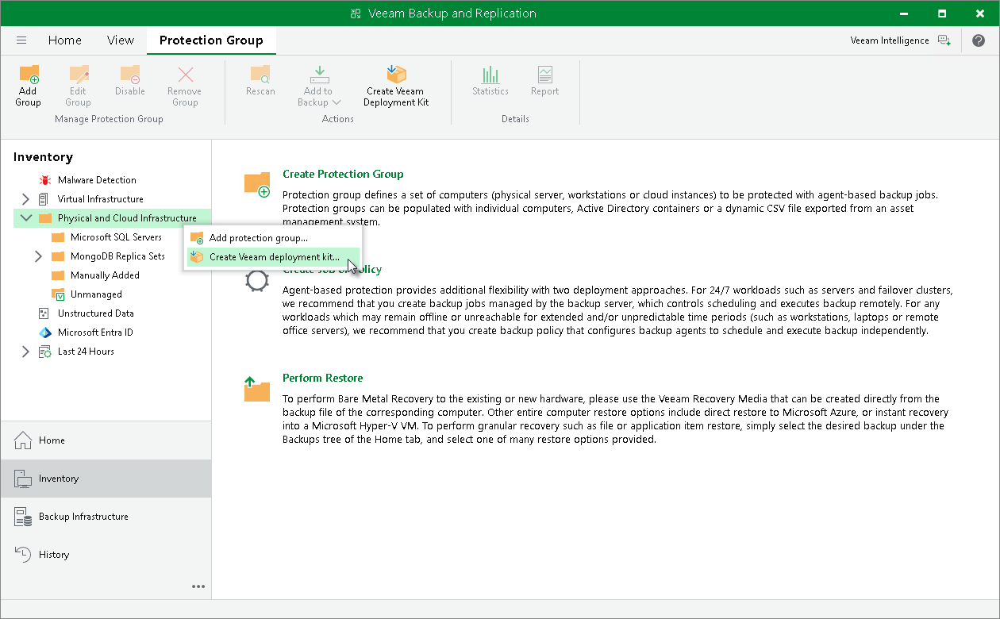

# Deploying Veeam Components for Certificate-Based Authentication

You have an option to install Veeam Agents on computers using certificate-based authentication instead of credentials. To do so, you must install Veeam Deployer Service on the computer and then add the computer to a protection group for MongoDB. In this case, Veeam Backup & Replication does not require SSH connection to install Veeam Agent.

To deploy Veeam components using Veeam Deployment Kit, perform the following steps:

1. On the Veeam Backup & Replication side, create and export Veeam Deployment Kit. You can do that in the following ways:

* Using PowerShell:

1. Start a Veeam PowerShell session. For more information, see the [Running Veeam Backup PowerShell Sessions](https://helpcenter.veeam.com/docs/vbr/powershell/running_sessions.html?ver=13) section in the Veeam PowerShell Reference.
2. Run the Generate-VBRBackupServerDeployerKit cmdlet to generate the Veeam Deployer Service temporary certificates and Veeam Deployer Service installation packages. To learn more, see the [Generate-VBRBackupServerDeployerKit](https://helpcenter.veeam.com/docs/vbr/powershell/generate-vbrbackupserverdeployerkit.html?ver=13) section in the Veeam PowerShell Reference.

* Using Veeam Backup & Replication console:

1. Open the Inventory view.
2. Click the Physical and Cloud Infrastructure node in the inventory pane and click Create Veeam Deployment Kit on the ribbon. Alternatively, right-click the Physical and Cloud Infrastructure node in the inventory pane and select Create Veeam deployment kit.
3. In the Create Deployment Kit window, specify a path to the folder to which Veeam Backup & Replication will export the deployment kit files.

1. Upload the exported files on the computer which database you want to protect.
2. On the MongoDB node side, install the uploaded files. You can do this in one of the following ways:

* Automatically, using a script provided with the installation files. To use this deployment option, navigate to the directory where you have saved the files on the computer and run the install-deployment-kit.sh script

|  |
| --- |
| TIP |
| You may need to modify the script according to your system configuration. |

* Manually, using a package manager:

1. Navigate to the directory where you have saved the files on the computer and install the Veeam Deployer Service and OpenSSL packages that suit the OS running on the computer with Veeam Plug-In.
2. Run the following commands to install the certificates and restart Veeam Deployer Service:

|  |
| --- |
| /opt/veeam/deployment/veeamdeploymentsvc --install-server-certificate server-cert.p12 |

1. On the Veeam Backup & Replication side, create a protection group with the following parameters:

1. When launching the New Protection Group wizard, select a protection group for MongoDB. For details, see [Launch New Protection Group Wizard](mongo_protection_group_launch.md).
2. At the Computers step of the wizard, specify a computer and select the Connect using certificate-based authentication method to connect to the computer. For details, see [Specify Computers](mongo_protection_group_scope_computers.md).

After you create the protection group, Veeam Backup & Replication will rescan the protection group. During the rescan operation, Veeam Backup & Replication will connect to the Veeam Deployer Service and install Veeam Agent. To learn more, see [Rescan Job](mongo_rescan_job.md).

Related Topics

* [Protection Group for MongoDB](mongo_protection_group_hiw.md)
* [Creating Protection Group for MongoDB](protection_group_create_mongo.md)

