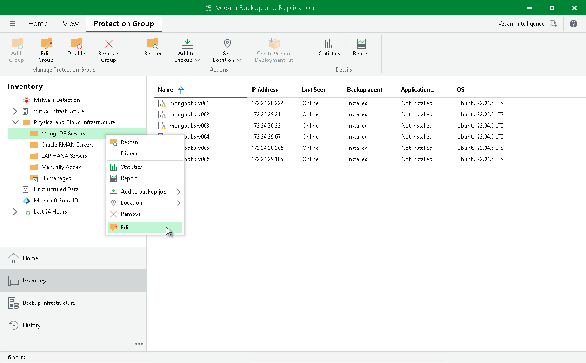

# Editing Protection Group Settings

You can edit the settings of a protection group. This operation may be required, for example, if you added a new node to the protected MongoDB replica set and you need to add it to a protection group.

To edit protection group settings:

1. Open the Inventory view.
2. In the inventory pane, expand the Physical Infrastructure node.
3. In the inventory pane, select the protection group that you want to edit and click Edit Group on the ribbon or right-click the protection group that you want to edit and select Properties.
4. Edit protection group settings as required.

