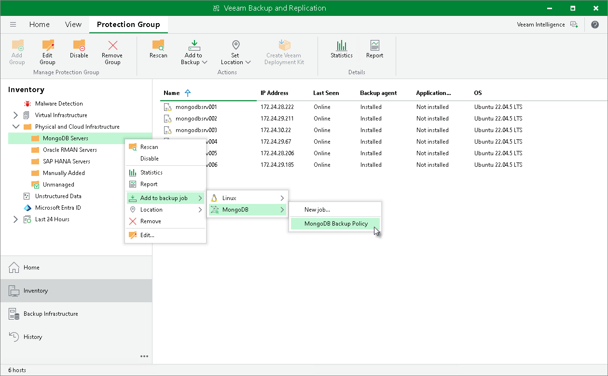

# Adding Protection Group to Application Backup Policy

To add a protection group to an application backup policy:

1. Open the Inventory view.
2. In the inventory pane, expand the Physical Infrastructure node and do one of the following:

* In the inventory pane, select the protection group that you want to add to the backup policy and click Add to Backup > MongoDB > name of the policy on the ribbon.
* In the inventory pane, right-click the protection group that you want to add to the backup policy and select Add to backup job > MongoDB > name of the policy.

|  |
| --- |
| Note |
| You can also add a protection group to a new application backup job. To learn more, see [Creating Protection Group for MongoDB](protection_group_create_mongo.md). |

