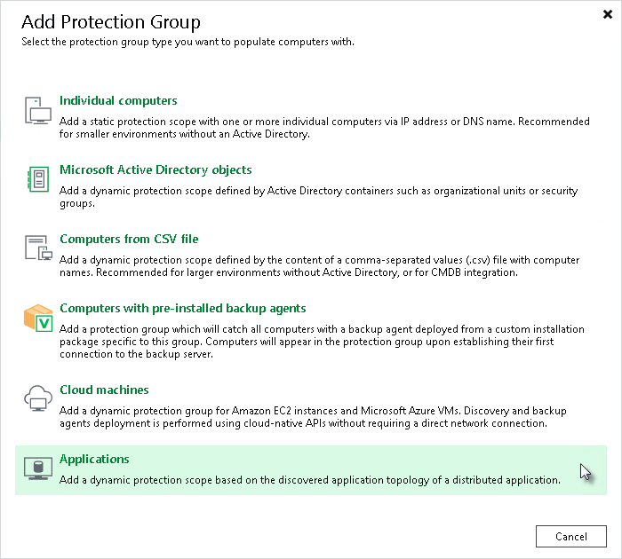

# Step 1. Launch New Protection Group Wizard

In this article

To launch the New Protection Group wizard, do the following:

1. Open the Inventory view.
2. Right-click the Physical Infrastructure node in the inventory pane and select Add protection group
3. In the Add Protection Group window, select Applications > MongoDB.

Page updated 8/22/2025

Page content applies to build 13.0.1.1071
