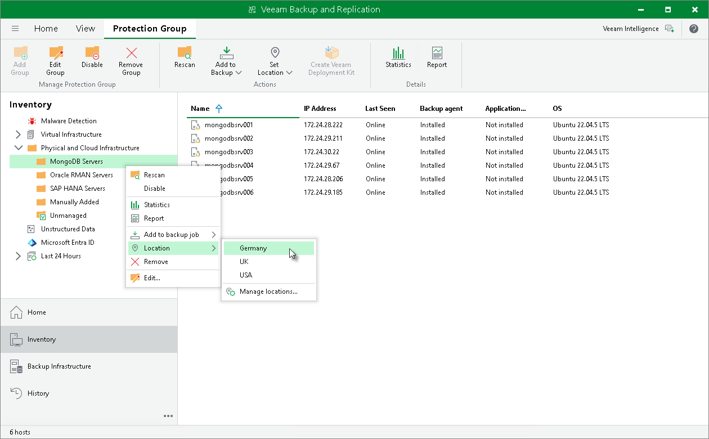

# Assigning Location to Protection Group

In this article

You can assign a location to a protection group configured in Veeam Backup & Replication. To assign a location:

1. Open the Inventory view.
2. In the inventory pane, expand the Physical Infrastructure node.
3. In the inventory pane, select the necessary protection group and click Location on the ribbon or right-click the necessary protection group, select Location and Manage locations.
4. In the Manage Locations window, select the necessary location or click Add to add a location.

For details on locations, see [Locations](locations.md).

Page updated 12/20/2024

Page content applies to build 13.0.1.1071
