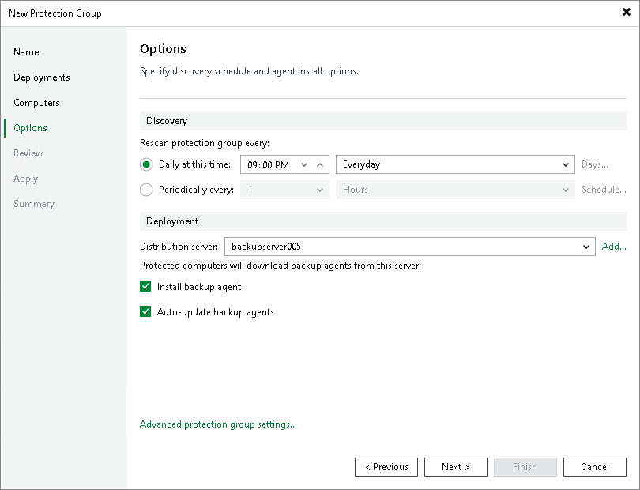

# Step 5. Specify Discovery and Deployment Options

At the Options step of the wizard, specify settings for protected computers discovery and Veeam components deployment.

Veeam Backup & Replication regularly connects to protected computers according to the schedule defined in the protection group settings. At this step of the wizard, you can define the discovery schedule and specify operations that Veeam Backup & Replication must perform on discovered computers. You can also select which server in your backup infrastructure should act as a distribution server for Veeam components.

To specify discovery and deployment options:

1. In the Discovery section, define schedule for automatic computer discovery within the scope of the protection group:

* To run the rescan job at specific time daily, on defined week days or with specific periodicity, select Daily at this time. Use the fields on the right to configure the necessary schedule.
* To run the rescan job repeatedly throughout a day with a specific time interval, select Periodically every. In the field on the right, select the necessary time unit: Hours or Minutes. Click Schedule and use the time table to define the permitted time window for the rescan job. In the Start time within an hour field, specify the exact time when the job must start.

* To run the rescan job continuously, select the Periodically every option and choose Continuously from the list on the right. A new rescan job session will start as soon as the previous rescan job session finishes.

|  |
| --- |
| NOTE |
| You cannot create a protection group without defining schedule for automatic discovery. However, you can disable automatic discovery for a specific protection group, if needed. To learn more, see [Disabling Protection Group](mongo_protection_group_disable.md). |

1. In the Deployment section, select the way Veeam Backup & Replication will deploy Veeam components on the replica set:

1. Select the object that will be responsible for the Veeam components distribution, select a Microsoft Windows server that you plan to use as a distribution server. Veeam Backup & Replication will use the distribution server to upload Veeam components setup files to computers added to the protection group. By default, Veeam Backup & Replication assigns the distribution server role to the backup server.
2. Make sure that the Install backup agent check box is selected if you want to instruct Veeam Backup & Replication to automatically install Veeam components on computers that you added to the protection group.
3. Make sure that the Auto-update backup agents check box is selected if you want to instruct Veeam Backup & Replication to automatically upgrade Veeam components on discovered computers when a new version of the product appears on the Veeam Backup & Replication server.

1. Click Advanced protection group settings to specify advanced settings for the protection group. To learn more, see [Specify Advanced Protection Group Settings](mongo_protection_group_advanced.md).

