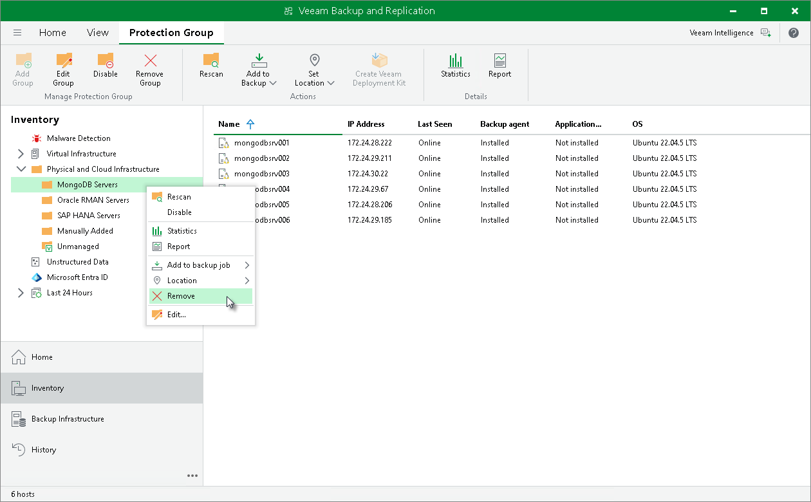

# Removing Protection Group

In this article

When you remove a protection group, you can instruct Veeam Backup & Replication to remove Veeam components from all protected computers included in this protection group, too. The protection group is removed permanently. You cannot undo this operation.

Backups created for computers that were included in the removed protection group remain intact in the backup location. You can delete this backup data manually later if needed.

|  |
| --- |
| NOTE |
| Consider the following:   * You cannot remove a protection group if the entire protection group, a replica set or a computer included in this protection group is added to an application backup policy, Veeam Agent backup job or policy. * You cannot remove default protection groups, such as Unmanaged, Out of Date and so on. |

To remove a protection group:

1. Open the Inventory view.
2. In the inventory pane, expand the Physical Infrastructure node.
3. In the inventory pane, select the protection group that you want to remove and click Remove Group on the ribbon or right-click the protection group and select Remove.
4. If you want to remove Veeam components deployed on protected computers, in the displayed window, select the Uninstall Everything check box. With this option selected, Veeam Backup & Replication will remove the protection group from the configuration database and, in addition, uninstall Veeam Plug-Ins and Veeam Agents and other Veeam components from every computer in the deleted protection group.
5. In the displayed window, click Yes.

|  |
| --- |
| TIP |
| If you want to remove a certain node from the protection group, you must exclude it from the backup scope in the protection group settings. For details, see [Specify Computers](mongo_protection_group_scope_computers.md). |

Page updated 12/20/2024

Page content applies to build 13.0.1.1071
