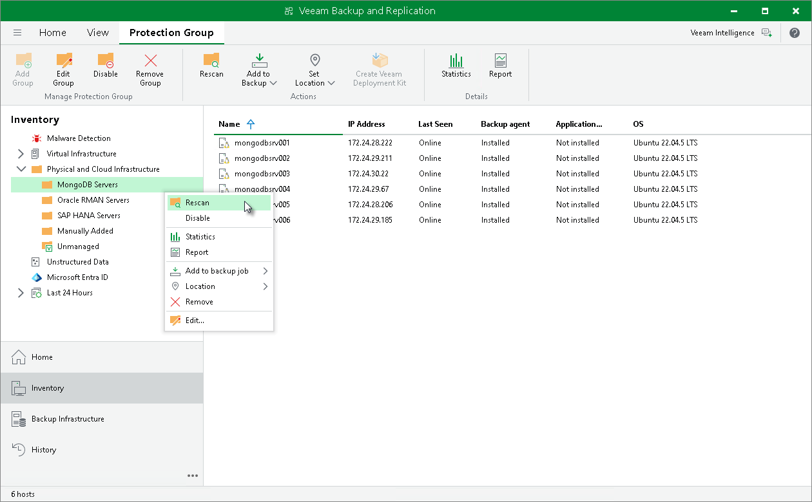

# Rescanning Protection Group

In this article

When you perform protection group rescan, you manually start the discovery process for the protection group. This operation may be required, for example, if you want to discover new computers added to the protection group without waiting for the next rescan.

During the rescan operation, Veeam Backup & Replication starts the rescan job in the same way as in case of scheduled discovery. The rescan job connects to computers included in the protection group and performs on these computers operations specified in the protection group settings. For example, you can use the rescan operation to collect information about configuration updates of the MongoDB replica set added to the backup scope of the protection group.

To rescan a protection group:

1. Open the Inventory view.
2. In the inventory pane, expand the Physical Infrastructure node.
3. In the inventory pane, select the necessary protection group and click Rescan on the ribbon or right-click the protection group and select Rescan.

Page updated 12/20/2024

Page content applies to build 13.0.1.1071
