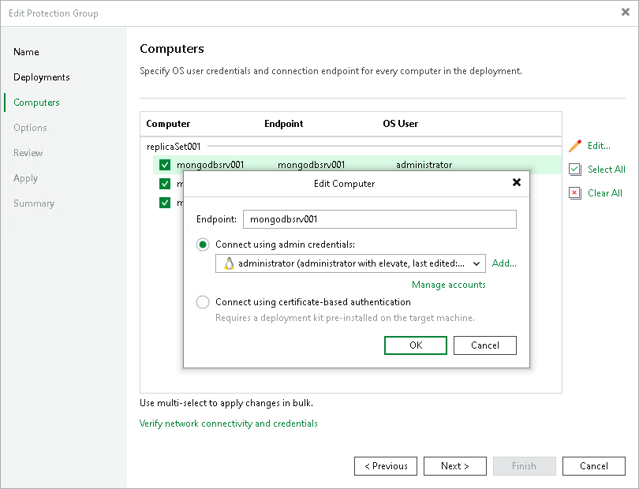

# Step 4. Specify Computers

In this article

At the Computers step of the wizard, select nodes that you want to protect and specify how Veeam Backup & Replication will connect to them.

To add a node to a backup scope:

1. In the Computers list, select check boxes near computers that you want to include in the backup scope.
2. To configure settings of the computer included in the backup scope, select the computer and click Edit.

|  |
| --- |
| Tip |
| If you want to apply the same settings to several computers, press and hold the [Ctrl] key, select computers and click Edit. |

1. In the Edit Computer window, if necessary, edit the name of the computer that you want to include in the backup scope using the Endpoint field.
2. In the Edit Computer window, select a method to connect to the computer:

* Connect using admin credentials. In this case, from the Credentials list, select a user account that has administrative permissions on the computer that you want to add to the protection group. Veeam Backup & Replication will use this account to connect to the protected computer (nodes of a replica set) and perform the necessary operations on the computer: upload and deploy Veeam components, and so on.

If you have not set up credentials beforehand, click the Manage accounts link or click Add on the right to add credentials.

Veeam Backup & Replication allows you to add the following types of credentials:

* Stored credentials. Select stored credentials if you want Veeam Backup & Replication to use the specified user name and password for each connection to computer.

* Single-use credentials. Select single-use credentials if you do not want Veeam Backup & Replication to store credentials in the configuration database. With this option selected, Veeam Backup & Replication will use the specified user name and password only for the first connection to the computer. After that, Veeam Backup & Replication will use Veeam Transport Service to communicate with the computer.

Keep in mind that the username must be specified in the [down-level logon name](https://docs.microsoft.com/en-us/windows/win32/secauthn/user-name-formats#down-level-logon-name) format. For example, DOMAIN\UserName or HOSTNAME\UserName. Use the full domain or hostname name. Do not replace them with a dot.

For more information, see [Credentials Manager](credentials_manager.md).

* Connect using certificate-based authentication. Select this option, if you chose to pre-install Veeam Deployer Service on the Linux computer that you want to include in the backup scope. In this case, Veeam Backup & Replication will communicate with the Linux computer using a certificate. Veeam Backup & Replication will install Transport Service that will be used to perform the necessary operations on the computer: upload and install Veeam components. To learn more, see [Deploying Plug-In for Certificate-Based Authentication](protection_group_deployer_service.md).

1. To check if Veeam Backup & Replication can communicate with the selected computers, click Verify network connectivity and credentials. Veeam Backup & Replication will use the specified credentials to connect to all computers in the list.

Page updated 8/13/2025

Page content applies to build 13.0.1.1071
