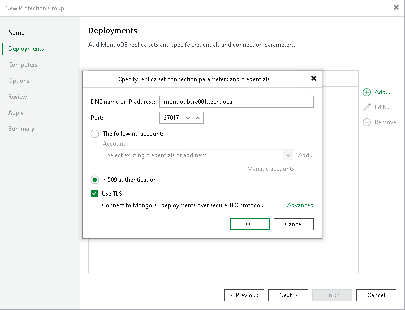
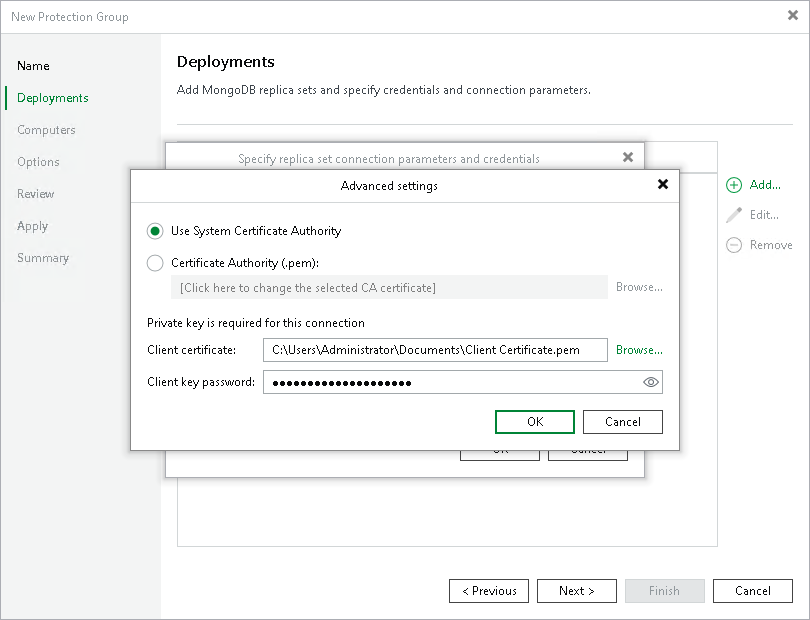

# Step 3. Specify Deployments

In this article

At the Deployments step of the wizard, select the MongoDB replica sets that you want to add to the protection group.

To add a MongoDB replica set to a protection group, click Add and specify the following:

1. In the DNS name or IP address field, enter a full DNS name, NetBIOS name or IP address of the MongoDB replica set that you want to add to the protection group.
2. In the Port field, specify a port number over which Veeam Backup & Replication must communicate with the MongoDB replica set. By default, Veeam Backup & Replication uses port 27017.
3. Select the method that Veeam Backup & Replication will use to authenticate against the MongoDB replica set:

* The following account. Select this options if you want to authenticate using user credentials, then select a user from the Account list. If you have not set up credentials beforehand, click the Manage accounts link or click Add on the right to add credentials. For more information, see [Credentials Manager](credentials_manager.md).

Mind that the user must have administrative permissions on the replica set that you want to add to the protection group. Veeam Backup & Replication will use this account to connect to the MongoDB replica set and collect information about replica set configuration. For more information, see [Rescan Job](mongo_rescan_job.md).

If you also want to use a secure TLS protocol, select the Use TLS check box and click Advanced and specify certificate details. For more information, see [Specify Certificate Details](#cert).

* X.509 authentication. Select this option if you want to authenticate using a X.509 certificate.

To authenticate using a certificate, you must use a secure TLS protocol. To use the TLS protocol, you need to select the Use TLS check box, click Advanced and specify certificate details. For more information, see [Specify Certificate Details](#cert).

For more information on authentication methods and limitations, see [Authentication Against Replica Set](mongo_auth_methods.md).

1. Repeat steps 1–3 for each MongoDB replica set that you want to add to the protection group.

Specify Certificate Details

If you want to use the TLS protocol to authenticate against the MongoDB replica set, specify the following connection settings:

|  |
| --- |
| Important |
| If you want to use TLS with your selected authentication method, consider access permissions listed in [Permissions](mongo_plan_and_manage_permissions.md). |

1. Specify the Certificate Authority:

* Select the Use System Certificate Authority option if you want to use the operating system Certificate Authority store to provide a TLS/SSL X.509 certificate.
* Select the Certificate Authority (.pem) option if you want to use a local .PEM file that contains TLS/SSL X.509 certificate. Then click Browse to upload one or more certificate files from trusted Certificate Authority.

1. In the Client certificate field, upload a local .PEM file that contains the client TLS/SSL X.509 certificate or the client TLS/SSL certificate and key.
2. In the Client key password field, specify the password if you uploaded a client key and this key is protected with a password. Otherwise, leave the field blank.

Page updated 9/2/2025

Page content applies to build 13.0.1.1071
