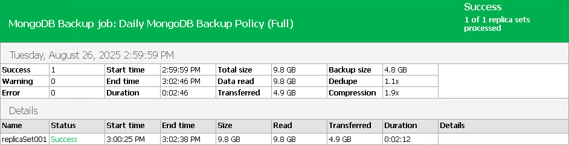

# Viewing Backup Policy Report

You can generate a report with details about application backup policy sessions performed on protected replica sets added to a backup policy. The report contains data on the latest backup policy session initiated for the backup policy. To generate a report:

1. Open the Home view.
2. In the inventory pane, click the Jobs node.
3. In the working area, select the necessary report:

* To get report for database data backup, click Report > Instance backup on the ribbon or right-click the backup policy and select Report > Instance backup.
* To get report for database logs backup, click Report > MongoDB oplog backup on the ribbon or right-click the backup policy and select Report > MongoDB oplog backup.

The report contains data on the latest policy session:

* Cumulative session statistics: details on the number of protected replica sets specified in the backup policy settings and the number of disconnected replica sets, details of the session performance, amount of read, processed and transferred data.
* Detailed statistics for every protected replica sets processed within the session: processing duration details, backup data size, amount of read and transferred data, list of warnings and errors (if any).

|  |
| --- |
| TIP |
| Consider the following:   * Generated reports are stored in the C:\Users\<username>\AppData\Local\Temp folder. * You can also set up Veeam Backup & Replication to send reports automatically by email. To learn more, see [Enabling Email Reporting](mongo_report_email.md). |

