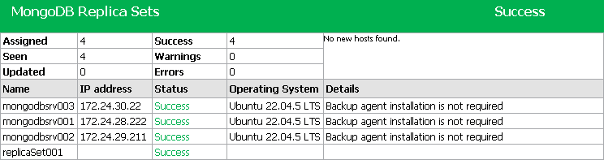

# Viewing Rescan Job Report

In this article

You can generate reports with details about rescan job sessions performed for a specific protection group. The report contains data on the latest rescan job session initiated for the job upon schedule. To generate a report:

1. Open the Inventory view.
2. In the inventory pane, select the necessary protection group and click Report on the ribbon or right-click the protection group and select Report.

The report contains the following data:

* Cumulative session statistics: details of the session performance, including the number of protected computers in the protection group and the number of newly discovered computers.
* Detailed statistics for every protected computer processed within the session: DNS name, IP address and operating system of the protected computer, list of warnings and errors (if any).

|  |
| --- |
| TIP |
| Consider the following:   * Generated reports are stored in the C:\Users\<username>\AppData\Local\Temp folder. * You can also set up Veeam Backup & Replication to send reports automatically by email. To learn more, see [Enabling Email Reporting](mongo_report_email.md). |

Page updated 8/26/2025

Page content applies to build 13.0.1.1071
